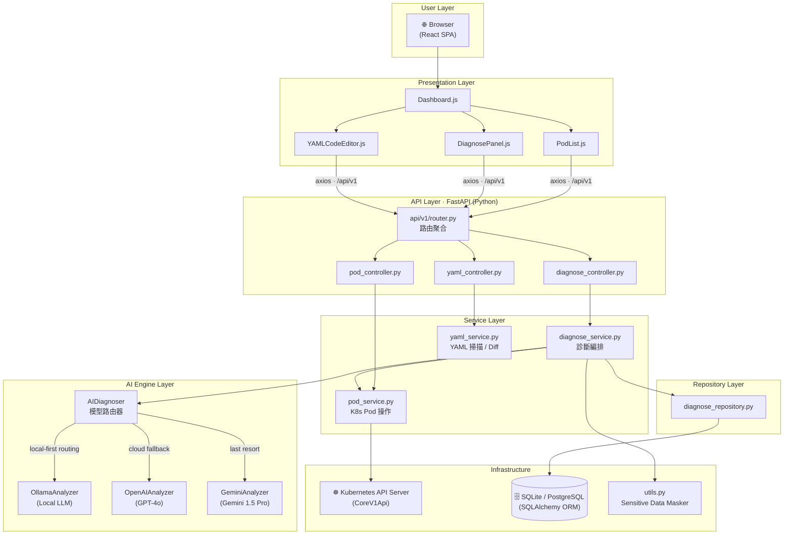
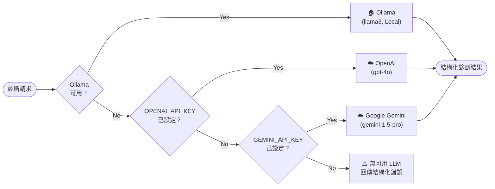
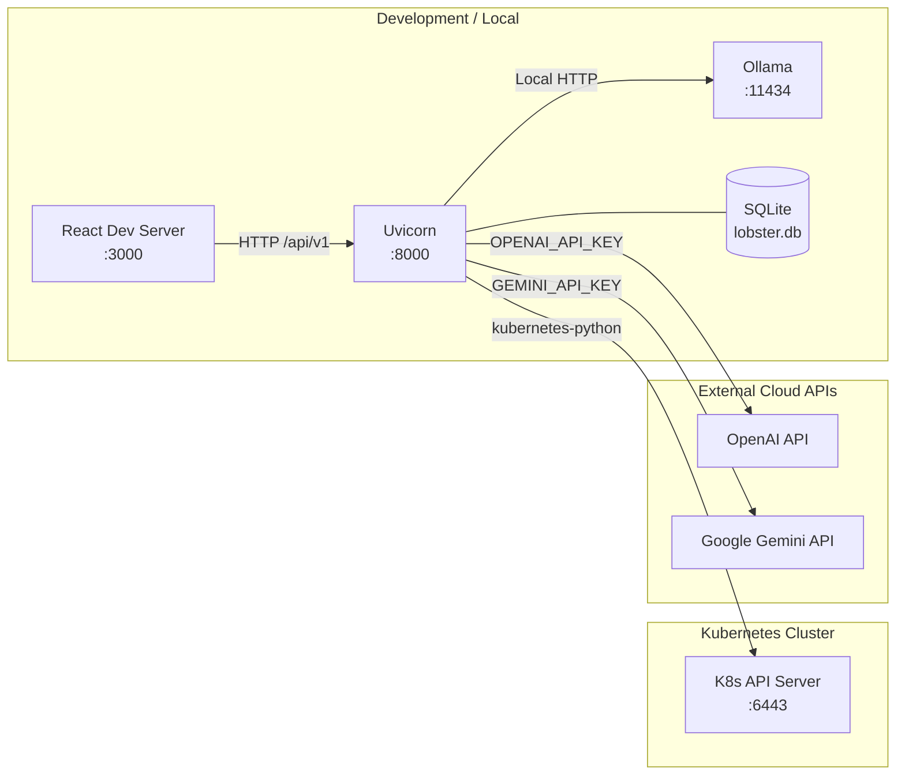

# 🦞 Lobster K8s Copilot - 系統架構設計文件 (SA)

> **版本**：v2.0 | **更新日期**：2026-03-06 | **依據**：實際程式碼 (commit: main)

---

## 1. 系統概述 (System Overview)

Lobster K8s Copilot 是一套以 Python 為核心的 Kubernetes 輔助系統，旨在將 AI 推理能力整合至 K8s 叢集管理工作流中。系統提供兩大核心功能：

1. **AI 故障診斷**：針對異常 Pod 自動收集上下文（describe / logs / events），路由至最合適的 LLM，輸出根本原因與修復建議。
2. **YAML 靜態分析**：對 Kubernetes manifest 執行七條安全/穩定性規則的靜態掃描，並提供 YAML diff 比對。

---

## 2. 系統層次架構圖 (Layered Architecture)

---

## 3. 模組職責分配 (Module Responsibilities)

### 3.1 Frontend (React 18 + Tailwind CSS 3)

| 模組 | 檔案 | 職責 |
|------|------|------|
| 主頁面 | `pages/Dashboard.js` | Tab 切換（叢集總覽 / YAML 編輯器）|
| Pod 列表 | `components/PodList.js` | 顯示 Pod 狀態徽章、觸發診斷 |
| 診斷側欄 | `components/DiagnosePanel.js` | 顯示 AI 診斷結果（Markdown 渲染）|
| YAML 編輯器 | `components/YAMLCodeEditor.js` | Monaco Editor + 即時掃描 |
| 資料 Hook | `hooks/useK8sData.js` | 30 秒自動刷新、狀態管理 |
| API 客戶端 | `utils/api.js` | axios 封裝、BASE_URL 配置 |

### 3.2 Backend API (Python · FastAPI 0.109+)

架構模式：**Controller → Service → Repository**

| 層級 | 模組 | 職責 |
|------|------|------|
| Controller | `pod_controller.py` | 路由處理、請求驗證 |
| Controller | `diagnose_controller.py` | 診斷路由、歷史查詢路由 |
| Controller | `yaml_controller.py` | YAML 掃描、Diff 路由 |
| Service | `pod_service.py` | K8s API 呼叫、Pod context 組裝 |
| Service | `diagnose_service.py` | 診斷流程編排、mask → LLM → 儲存 |
| Service | `yaml_service.py` | YAML 解析、規則引擎、DeepDiff |
| Repository | `diagnose_repository.py` | 診斷歷史的 CRUD 操作 |
| Utility | `utils.py` | Sensitive data masking（Regex）|
| Entry | `main.py` | FastAPI app、CORS、Rate Limiting、K8s config |

### 3.3 AI Engine (ai-engine/)

| 模組 | 職責 |
|------|------|
| `diagnoser.py` | 多模型路由器（Local-first strategy）|
| `analyzers/base_analyzer.py` | 抽象介面（所有 LLM Provider 實作此介面）|
| `analyzers/ollama_analyzer.py` | 本地 LLM（隱私優先）|
| `analyzers/openai_analyzer.py` | GPT-4o（雲端，高品質）|
| `analyzers/gemini_analyzer.py` | Gemini 1.5 Pro（雲端備援）|
| `prompts/k8s_prompts.py` | Prompt Template（Senior K8s SRE Expert 角色）|

### 3.4 資料庫 (SQLAlchemy 2.0+)

- 預設使用 **SQLite** (`lobster.db`)
- 可透過 `DATABASE_URL` 環境變數切換 **PostgreSQL**
- ORM 模型：`orm_models.py`（`Project`、`DiagnoseHistory`）

---

## 4. AI 模型路由策略 (LLM Routing Strategy)

**設計原則**：Local-first（保護隱私）→ Cloud fallback（高品質）→ Graceful degradation（服務可用性）

---

## 5. 安全架構 (Security Architecture)

| 機制 | 實作位置 | 說明 |
|------|----------|------|
| Sensitive Data Masking | `utils.py` | Regex 過濾 `password`, `token`, `secret`, `key`, `api_key`, `bearer`, `basic` |
| Rate Limiting | `main.py` (slowapi) | IP 層級限流，防止 LLM API 費用超支 |
| CORS | `main.py` | 可設定 `ALLOWED_ORIGINS`，預設 `*` |
| K8s RBAC | K8s 叢集層 | 透過 ServiceAccount 或 kubeconfig 授權 |
| 無使用者認證 | — | 現行版本為內部工具，無 JWT/Session |

---

## 6. 部署架構 (Deployment Architecture)

---

## 7. 環境變數 (Environment Variables)

| 變數 | 用途 | 預設值 | 必填 |
|------|------|--------|------|
| `DATABASE_URL` | 資料庫連線字串 | `sqlite:///./lobster.db` | 否 |
| `OPENAI_API_KEY` | OpenAI API 金鑰 | — | 使用 GPT 時 |
| `OPENAI_MODEL` | GPT 模型名稱 | `gpt-4o` | 否 |
| `GEMINI_API_KEY` | Google Gemini API 金鑰 | — | 使用 Gemini 時 |
| `GEMINI_MODEL` | Gemini 模型 ID | `gemini-1.5-pro` | 否 |
| `OLLAMA_BASE_URL` | Ollama API 端點 | `http://localhost:11434` | 使用 Ollama 時 |
| `OLLAMA_MODEL` | Ollama 模型名稱 | `llama3` | 否 |
| `ALLOWED_ORIGINS` | CORS 允許來源 | `*` | 否 |
| `REACT_APP_API_URL` | 前端 API 端點 | `http://localhost:8000/api/v1` | 否 |

---

## 8. 技術堆疊 (Tech Stack)

| 層級 | 技術 | 版本 |
|------|------|------|
| Frontend | React | 18.2+ |
| Frontend | Tailwind CSS | 3.4+ |
| Frontend | Monaco Editor | 4.6+ |
| Frontend | axios | latest |
| Backend | Python | 3.10+ |
| Backend | FastAPI | 0.109+ |
| Backend | Uvicorn | 0.27+ |
| Backend | SQLAlchemy | 2.0+ |
| K8s Client | kubernetes-python | 29.0+ |
| AI | openai | latest |
| AI | google-generativeai | latest |
| AI | Ollama | HTTP API |
| Utilities | pyyaml, deepdiff, slowapi | latest |
| Testing | pytest, pytest-asyncio | 8.0+ |

---

*文件版本：v2.0 | 更新日期：2026-03-06 | 撰寫依據：實際程式碼*
