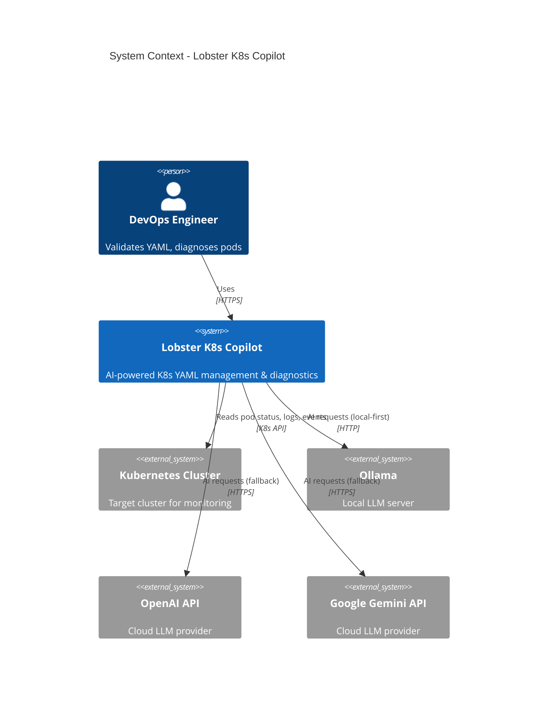
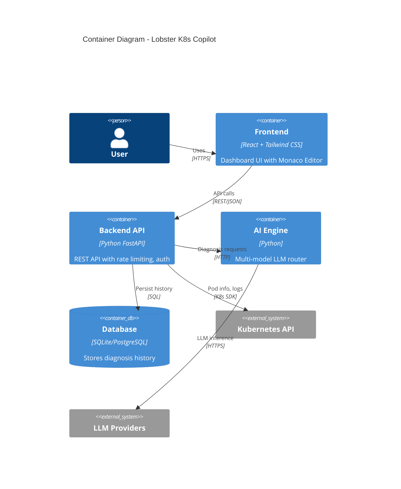
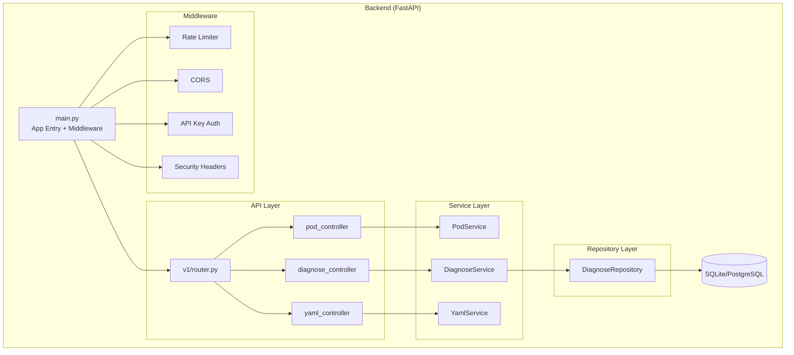
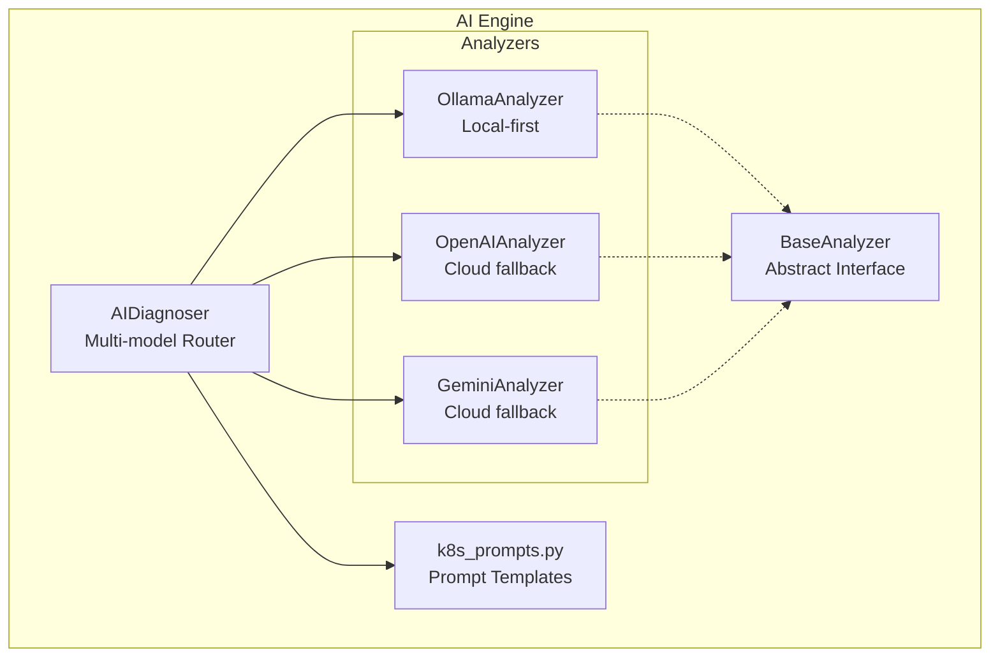
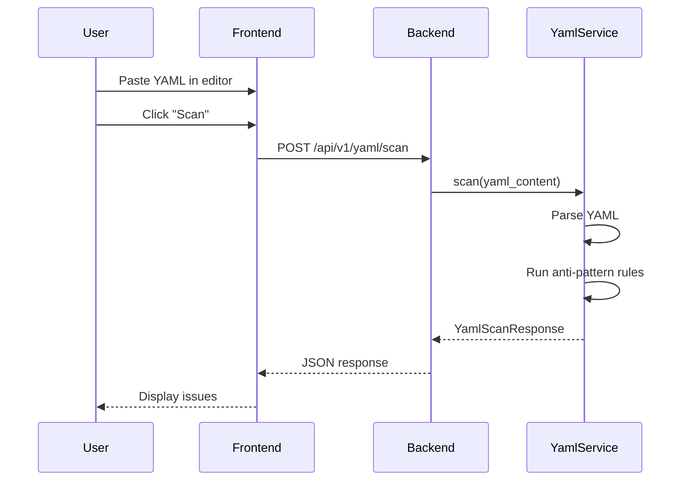
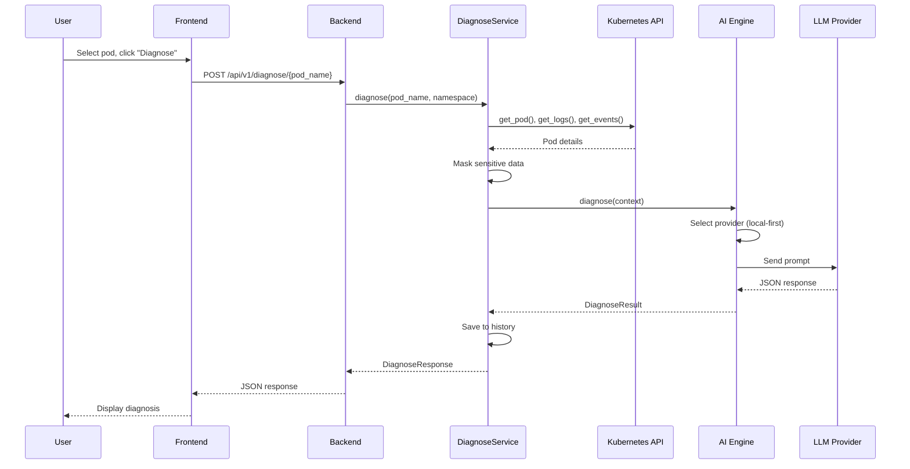
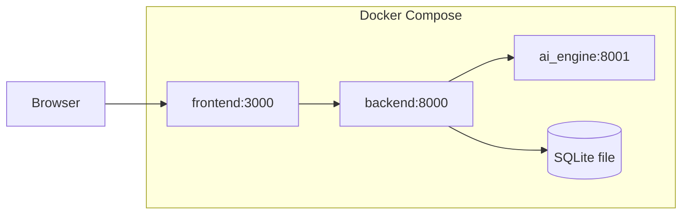
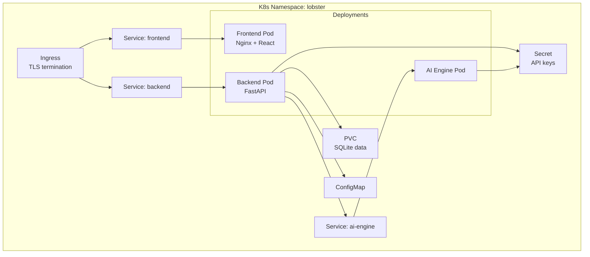

# 🦞 Lobster K8s Copilot - System Architecture (SA)

> **Version**: 1.0 | **Date**: 2026-03-07 | **Status**: Approved

---

## 1. System Context Diagram

---

## 2. Container Diagram

---

## 3. Component Architecture

### 3.1 Backend Components

### 3.2 AI Engine Components

---

## 4. Data Flow

### 4.1 YAML Scan Flow

### 4.2 AI Diagnosis Flow

---

## 5. Deployment Architecture

### 5.1 Docker Compose (Development)

### 5.2 Kubernetes (Production)

---

## 6. Security Architecture

### 6.1 Authentication & Authorization

| Layer | Mechanism |
|-------|-----------|
| API | Optional API key via `X-API-Key` or `Bearer` token |
| K8s | ServiceAccount with RBAC (read-only pods, logs, events) |
| Database | Application-level access only |

### 6.2 Data Security

| Concern | Mitigation |
|---------|------------|
| Secrets in logs | Regex-based masking before sending to LLM |
| CORS | Configurable allowed origins |
| Headers | X-Frame-Options, X-Content-Type-Options, HSTS |
| Input validation | Pydantic schemas with size limits |

---

## 7. Technology Stack

| Component | Technology | Version |
|-----------|------------|---------|
| Backend | Python + FastAPI | 3.11+ / 0.100+ |
| Frontend | React + Tailwind | 18+ / 3+ |
| AI Engine | Python + httpx | 3.11+ |
| Database | SQLAlchemy + SQLite/PostgreSQL | 2.0+ |
| Container | Docker + docker-compose | 24+ / 2+ |
| Orchestration | Kubernetes | 1.25+ |

---

## 8. Scalability Considerations

| Aspect | Strategy |
|--------|----------|
| Backend | Stateless, horizontal scaling via replicas |
| AI Engine | Stateless, can scale independently |
| Database | PostgreSQL with connection pooling for production |
| Rate Limiting | Per-IP rate limiting via SlowAPI |

---

*Document Owner: Architecture Team*
*Last Updated: 2026-03-07*
