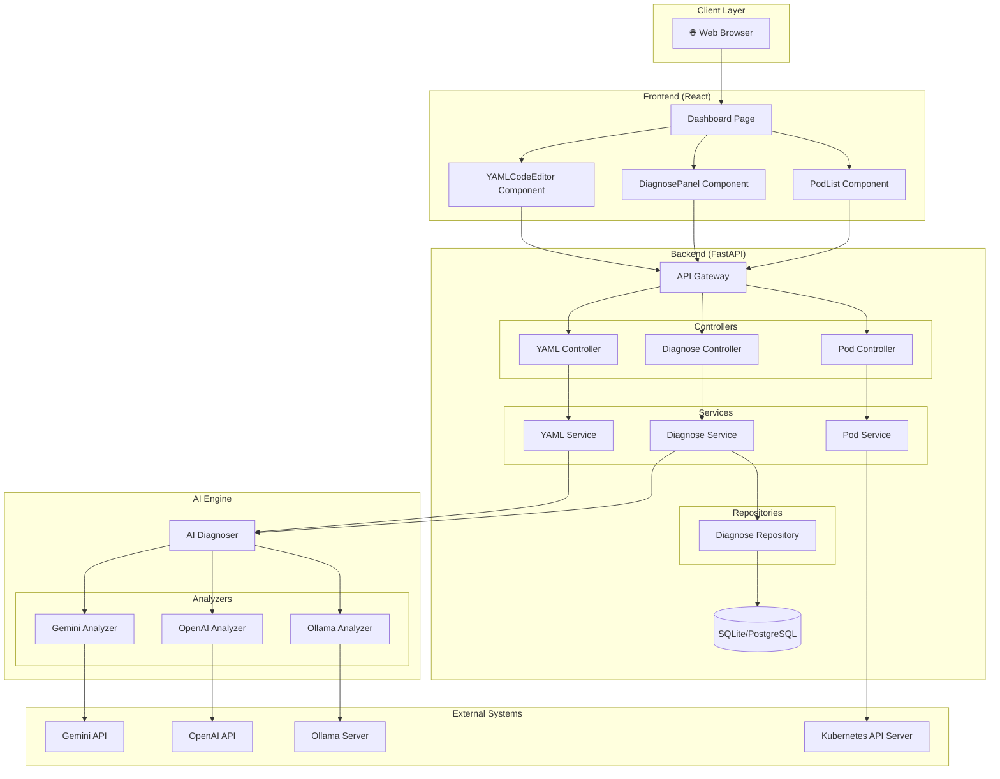
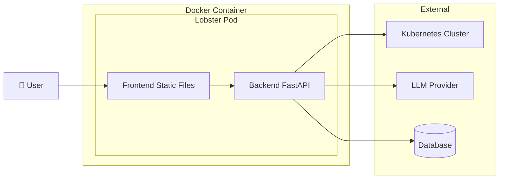
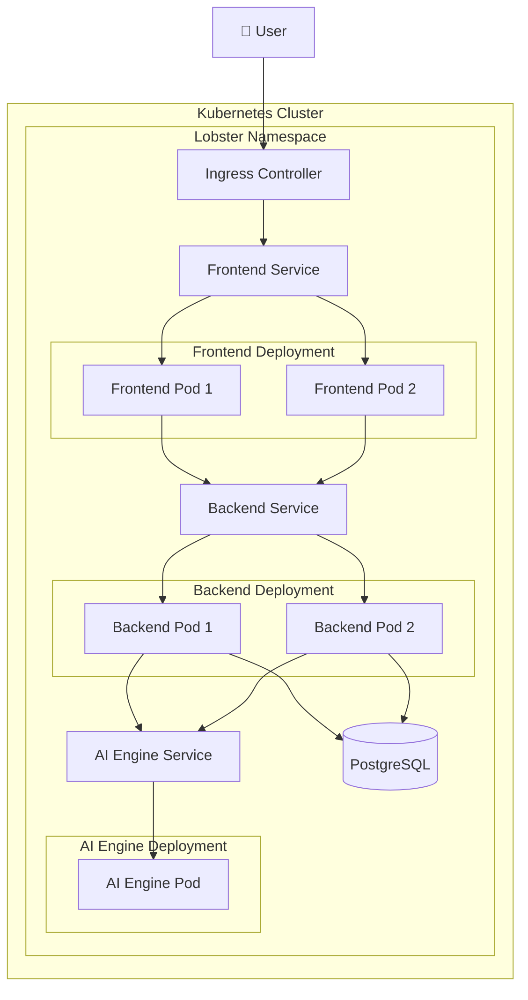
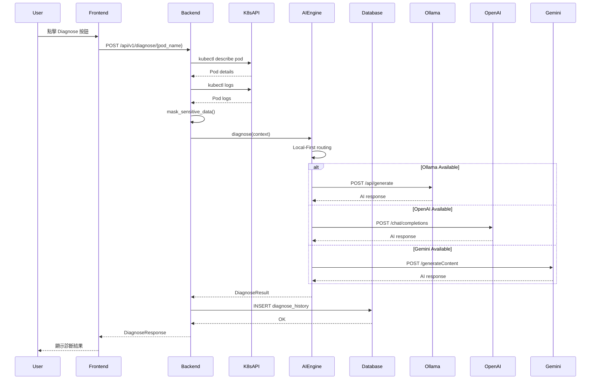
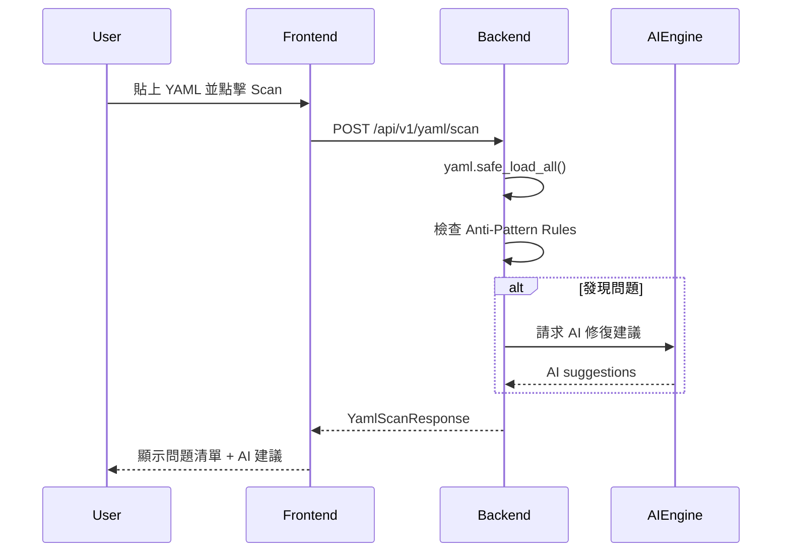
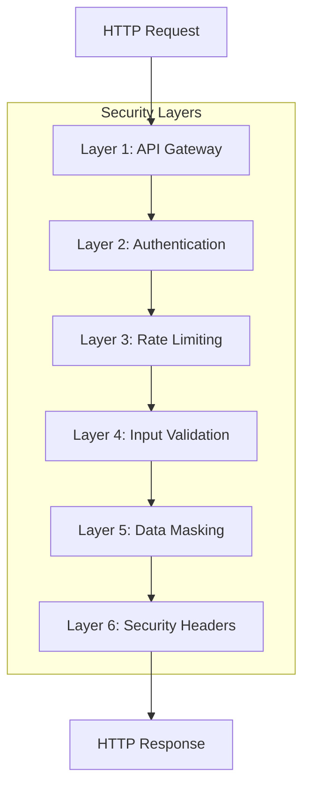
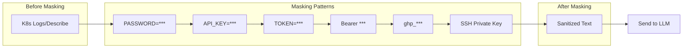

# 🦞 Lobster K8s Copilot - 系統架構文件 (SA)

> **Version**: 1.0.0 | **Status**: Production Ready | **Last Updated**: 2026-03-07

---

## 1. 系統概觀 (System Overview)

Lobster K8s Copilot 採用 **分層式架構 (Layered Architecture)**，將系統分為 Frontend、Backend、AI Engine 三個主要模組。



---

## 2. 部署架構 (Deployment Architecture)

### 2.1 單體部署模式 (Monolithic)



### 2.2 微服務部署模式 (Microservices)



---

## 3. 模組架構 (Module Architecture)

### 3.1 Backend 模組

```
backend/
├── main.py                 # FastAPI 進入點 + Middleware
├── database.py             # SQLAlchemy 連線設定
├── utils.py                # 敏感資料遮罩、驗證工具
├── api/
│   └── v1/
│       └── router.py       # API v1 路由聚合
├── controllers/            # HTTP 請求處理層
│   ├── pod_controller.py
│   ├── diagnose_controller.py
│   └── yaml_controller.py
├── services/               # 商業邏輯層
│   ├── pod_service.py
│   ├── diagnose_service.py
│   └── yaml_service.py
├── repositories/           # 資料存取層
│   └── diagnose_repository.py
└── models/
    ├── schemas.py          # Pydantic Request/Response Models
    └── orm_models.py       # SQLAlchemy ORM Models
```

### 3.2 AI Engine 模組

```
ai_engine/
├── main.py                 # Standalone FastAPI (微服務模式)
├── diagnoser.py            # 多模型路由器
├── analyzers/
│   ├── base_analyzer.py    # 抽象基底類別
│   ├── ollama_analyzer.py  # Ollama 本地模型
│   ├── openai_analyzer.py  # OpenAI GPT
│   └── gemini_analyzer.py  # Google Gemini
└── prompts/
    └── k8s_prompts.py      # Prompt 模板
```

### 3.3 Frontend 模組

```
frontend/
├── src/
│   ├── App.js              # 主應用元件
│   ├── index.js            # React 進入點
│   ├── components/
│   │   ├── PodList.js      # Pod 列表元件
│   │   ├── DiagnosePanel.js # AI 診斷面板
│   │   └── YAMLCodeEditor.js # Monaco 編輯器
│   ├── pages/
│   │   └── Dashboard.js    # 主頁面
│   ├── hooks/
│   │   └── useK8sData.js   # K8s 資料 Hook
│   └── utils/
│       └── api.js          # API 客戶端
└── public/
    └── index.html
```

---

## 4. 資料流程 (Data Flow)

### 4.1 Pod 診斷流程



### 4.2 YAML 掃描流程



---

## 5. 安全架構 (Security Architecture)



### 5.1 安全機制

| 機制 | 實作方式 |
|------|----------|
| **認證** | API Key via `Authorization: Bearer` 或 `X-API-Key` header |
| **授權** | LOBSTER_API_KEY 環境變數控制 |
| **Rate Limiting** | SlowAPI (IP-based) |
| **輸入驗證** | Pydantic validators + K8S_NAME_RE |
| **資料遮罩** | 多重正規表達式過濾敏感資訊 |
| **安全 Headers** | SecurityHeadersMiddleware |
| **CORS** | 白名單模式 (ALLOWED_ORIGINS) |

### 5.2 敏感資料處理



---

## 6. 可擴展性設計 (Scalability)

### 6.1 水平擴展

- **Frontend**: 可透過 K8s Deployment replicas 水平擴展
- **Backend**: 無狀態設計，可水平擴展
- **Database**: 使用 PostgreSQL 支援連接池

### 6.2 AI Provider 擴展

```python
# 新增 AI Provider 只需實作 BaseAnalyzer
class BaseAnalyzer(ABC):
    @property
    @abstractmethod
    def model_name(self) -> str: ...
    
    @abstractmethod
    def analyze(self, prompt: str) -> str: ...
    
    def is_available(self) -> bool: ...
```

---

## 7. 技術決策記錄 (ADR)

### ADR-001: 選擇 FastAPI 作為 Backend Framework

- **狀態**: 已採納
- **原因**: 原生 async 支援、自動 OpenAPI 文件、Pydantic 整合
- **替代方案**: Flask, Django REST Framework

### ADR-002: Local-First AI 策略

- **狀態**: 已採納
- **原因**: 降低 API 成本、減少延遲、支援離線環境
- **替代方案**: Cloud-Only

### ADR-003: 分層架構 (Controller-Service-Repository)

- **狀態**: 已採納
- **原因**: 職責分離、易於測試、便於維護
- **替代方案**: 單層式 MVC

---

## 8. 監控與可觀測性 (Observability)

| 類型 | 工具 | 說明 |
|------|------|------|
| **Logging** | Python logging | 結構化日誌 |
| **Health Check** | `GET /` | 回傳版本與狀態 |
| **K8s Probe** | `/api/v1/cluster/status` | 檢查 K8s 連線 |

---

*文件建立日期：2026-03-07*  
*撰寫者：System Architect (Lobster Team)*
