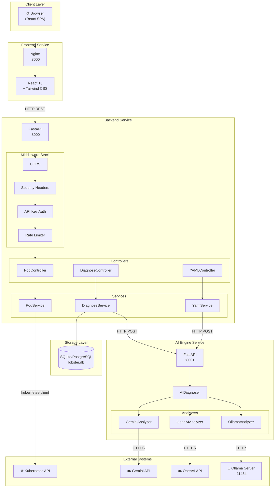
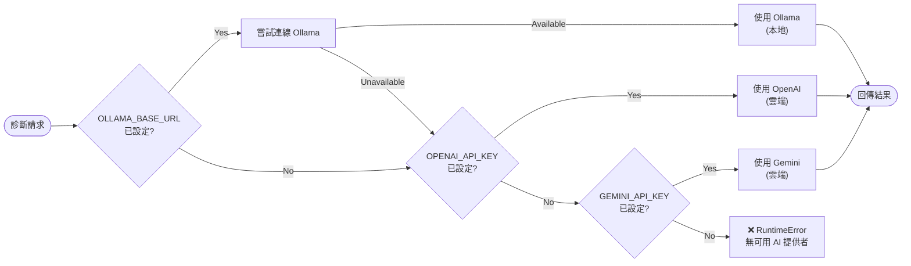
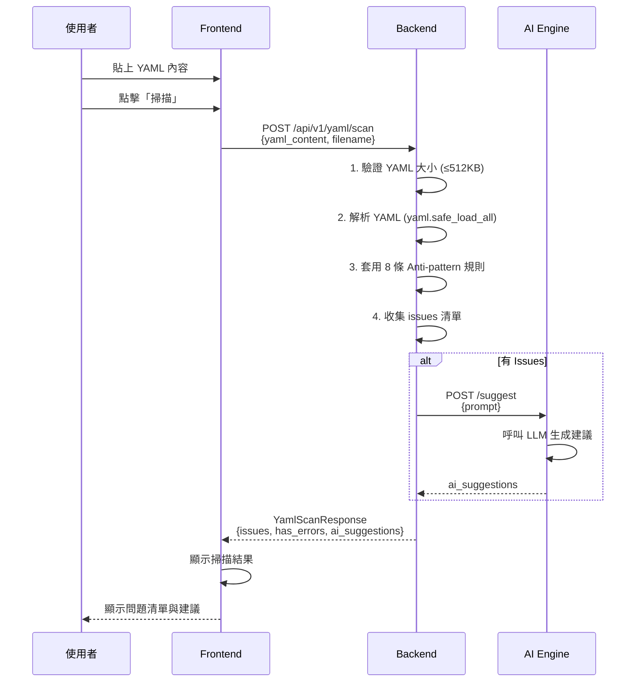
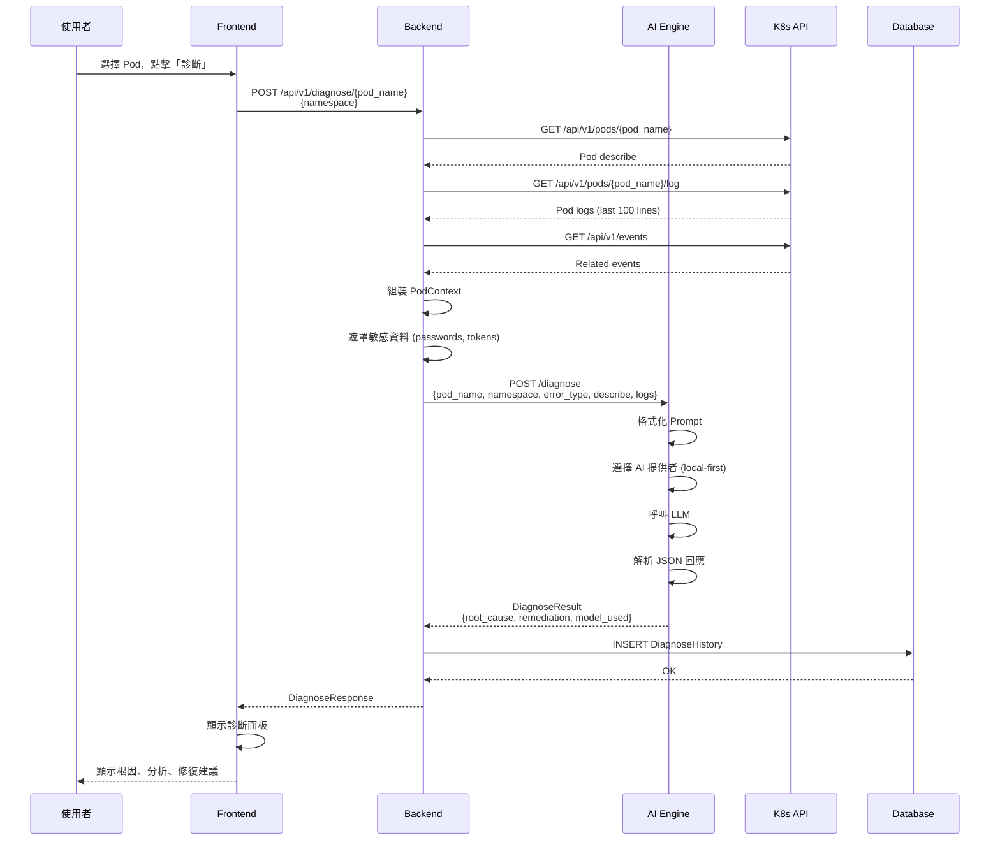
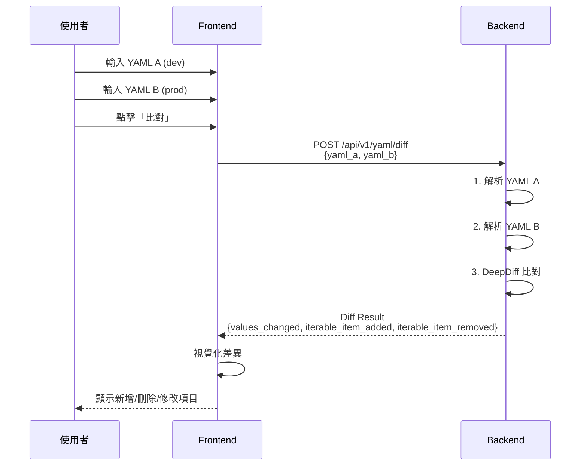
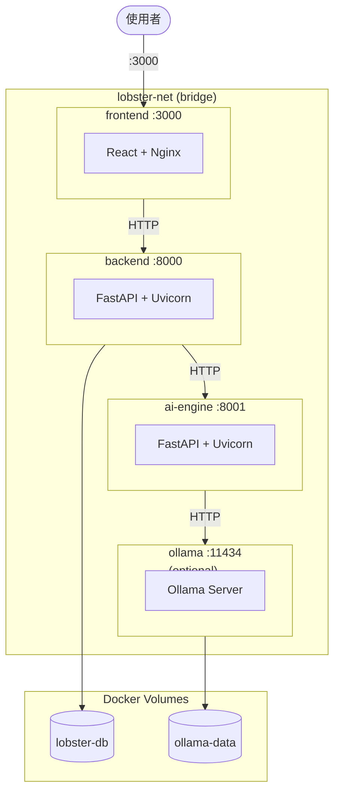
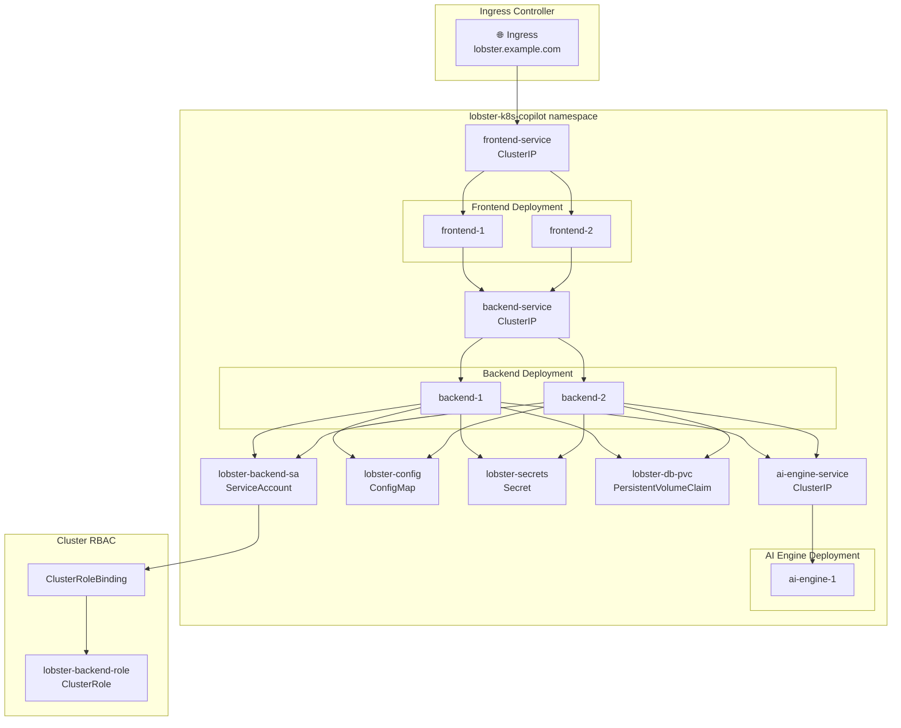
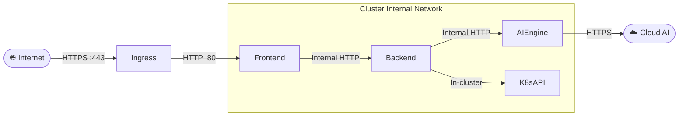

# 🦞 Lobster K8s Copilot - System Architecture (SA)

> **版本**: 1.0.0  
> **最後更新**: 2026-03-07  
> **狀態**: APPROVED

---

## 1. 系統概覽

**Lobster K8s Copilot** 採用微服務架構，由三個主要服務組成：Frontend、Backend 和 AI Engine。系統設計遵循以下原則：

- **Local-first AI**: 優先使用本地 Ollama 模型，保護資料隱私
- **無狀態服務**: Backend 和 AI Engine 皆為無狀態，支援水平擴展
- **鬆耦合設計**: 各服務透過 HTTP REST API 通訊
- **漸進增強**: 功能降級時不影響核心能力

---

## 2. 高階系統架構圖



---

## 3. 元件職責

### 3.1 Frontend Service

| 元件 | 職責 | 技術 |
|------|------|------|
| **Nginx** | 靜態檔案伺服、反向代理、gzip 壓縮 | Nginx 1.25 |
| **React SPA** | 使用者介面、狀態管理、API 呼叫 | React 18 + React Router |
| **Tailwind CSS** | 樣式系統、響應式設計、深色主題 | Tailwind CSS 3.x |
| **Monaco Editor** | YAML 編輯器、語法高亮 | @monaco-editor/react |

**主要頁面與元件**:

| 元件 | 檔案路徑 | 職責 |
|------|---------|------|
| `Dashboard` | `pages/Dashboard.js` | 主頁面容器、狀態管理、Tab 切換 |
| `PodList` | `components/PodList.js` | Pod 列表顯示、診斷按鈕、狀態標籤 |
| `DiagnosePanel` | `components/DiagnosePanel.js` | 診斷結果滑入面板 |
| `YAMLCodeEditor` | `components/YAMLCodeEditor.js` | YAML 編輯與掃描功能 |
| `useK8sData` | `hooks/useK8sData.js` | 叢集資料 Hook（Pod、狀態） |

---

### 3.2 Backend Service

| 元件 | 職責 | 檔案路徑 |
|------|------|---------|
| **FastAPI App** | HTTP 路由、中介軟體、生命週期管理 | `main.py` |
| **PodController** | Pod 查詢端點 | `controllers/pod_controller.py` |
| **DiagnoseController** | AI 診斷端點、歷史記錄 | `controllers/diagnose_controller.py` |
| **YAMLController** | YAML 掃描與 Diff 端點 | `controllers/yaml_controller.py` |
| **PodService** | K8s API 互動、Pod 上下文收集 | `services/pod_service.py` |
| **DiagnoseService** | 診斷流程編排、資料遮罩、持久化 | `services/diagnose_service.py` |
| **YamlService** | YAML 靜態分析、Anti-pattern 偵測 | `services/yaml_service.py` |
| **DiagnoseRepository** | 診斷歷史資料存取 | `repositories/diagnose_repository.py` |
| **ORM Models** | 資料表定義 | `models/orm_models.py` |
| **Pydantic Schemas** | 請求/回應驗證 | `models/schemas.py` |

**中介軟體堆疊 (執行順序)**:

```
請求進入 → CORS → SecurityHeaders → APIKeyAuth → RateLimiter → Router → Controller
```

| 中介軟體 | 職責 | 配置 |
|---------|------|------|
| `CORSMiddleware` | 跨域請求控制 | `ALLOWED_ORIGINS` 環境變數 |
| `SecurityHeadersMiddleware` | 安全標頭注入 | X-Content-Type-Options, X-Frame-Options, HSTS |
| `APIKeyAuthMiddleware` | API 認證 (可選) | `LOBSTER_API_KEY` 環境變數 |
| `SlowAPI` | 請求速率限制 | slowapi 函式庫 |

---

### 3.3 AI Engine Service

| 元件 | 職責 | 檔案路徑 |
|------|------|---------|
| **FastAPI App** | AI 服務端點 | `main.py` |
| **AIDiagnoser** | 模型路由、回應解析 | `diagnoser.py` |
| **BaseAnalyzer** | 分析器抽象介面 | `analyzers/base_analyzer.py` |
| **OllamaAnalyzer** | Ollama 本地模型整合 | `analyzers/ollama_analyzer.py` |
| **OpenAIAnalyzer** | OpenAI API 整合 | `analyzers/openai_analyzer.py` |
| **GeminiAnalyzer** | Google Gemini API 整合 | `analyzers/gemini_analyzer.py` |
| **Prompts** | K8s 診斷提示詞模板 | `prompts/k8s_prompts.py` |

**模型選擇策略 (Local-first Routing)**:



---

### 3.4 Storage Layer

| 元件 | 技術 | 用途 |
|------|------|------|
| **SQLite** | SQLite 3 | 開發環境、單機部署 |
| **PostgreSQL** | PostgreSQL 14+ | 生產環境、多副本部署 |
| **SQLAlchemy** | SQLAlchemy 2.0 | ORM、資料庫抽象 |
| **Alembic** | Alembic | 資料庫遷移 |

---

## 4. 資料流

### 4.1 YAML 掃描流程



### 4.2 AI 故障診斷流程



### 4.3 多環境 YAML Diff 流程



---

## 5. 部署架構

### 5.1 Docker Compose (開發/單機)



**服務依賴關係**:

| 服務 | 依賴 | 健康檢查 |
|------|------|---------|
| `ai-engine` | (無) | `GET /health` |
| `backend` | `ai-engine` (healthy) | `GET /` |
| `frontend` | `backend` (healthy) | (nginx 預設) |
| `ollama` | (無) | (profiles: with-ollama) |

### 5.2 Kubernetes (生產)



**Kubernetes 資源**:

| 資源類型 | 名稱 | 用途 |
|---------|------|------|
| Namespace | `lobster-k8s-copilot` | 隔離專案資源 |
| Deployment | `backend` | 後端 2 副本 |
| Deployment | `frontend` | 前端 2 副本 |
| Deployment | `ai-engine` | AI 引擎 1 副本 |
| Service | `backend-service` | ClusterIP |
| Service | `frontend-service` | ClusterIP |
| Service | `ai-engine-service` | ClusterIP |
| Ingress | `lobster-ingress` | 外部流量路由 |
| ConfigMap | `lobster-config` | 非敏感配置 |
| Secret | `lobster-secrets` | API Keys |
| PVC | `lobster-db-pvc` | 資料庫持久化 |
| ServiceAccount | `lobster-backend-sa` | K8s API 存取 |
| ClusterRole | `lobster-backend-role` | Pod/Log 讀取權限 |

---

## 6. 第三方依賴

### 6.1 Backend Dependencies

| 套件 | 版本 | 用途 |
|------|------|------|
| `fastapi` | 1.0.0 | Web 框架 |
| `uvicorn` | 0.32+ | ASGI 伺服器 |
| `pydantic` | 2.x | 資料驗證 |
| `sqlalchemy` | 2.0+ | ORM |
| `alembic` | 1.13+ | 資料庫遷移 |
| `kubernetes` | 31+ | K8s Python Client |
| `pyyaml` | 6.0+ | YAML 解析 |
| `deepdiff` | 8.0+ | YAML Diff |
| `httpx` | 0.27+ | HTTP Client |
| `slowapi` | 0.1+ | Rate Limiting |

### 6.2 AI Engine Dependencies

| 套件 | 版本 | 用途 |
|------|------|------|
| `fastapi` | 1.0.0 | Web 框架 |
| `uvicorn` | 0.32+ | ASGI 伺服器 |
| `httpx` | 0.27+ | Ollama HTTP Client |
| `openai` | 1.x | OpenAI SDK |
| `google-generativeai` | 0.8+ | Gemini SDK |

### 6.3 Frontend Dependencies

| 套件 | 版本 | 用途 |
|------|------|------|
| `react` | 18.x | UI 框架 |
| `react-router-dom` | 6.x | 路由 |
| `tailwindcss` | 3.x | CSS 框架 |
| `@monaco-editor/react` | 4.x | YAML 編輯器 |
| `axios` | 1.x | HTTP Client |

---

## 7. 外部系統整合

### 7.1 Kubernetes API

**連線方式**:
1. **In-cluster**: 自動載入 ServiceAccount token
2. **Out-of-cluster**: 讀取 `~/.kube/config` 或 `KUBECONFIG` 環境變數

**所需權限**:

```yaml
apiGroups: [""]
resources: ["pods", "pods/log", "namespaces"]
verbs: ["get", "list", "watch"]
```

**超時配置**:

| 操作 | 環境變數 | 預設值 |
|------|---------|--------|
| Pod/Event 列表 | `K8S_LIST_TIMEOUT` | 30s |
| 單一物件讀取 | `K8S_READ_TIMEOUT` | 15s |
| Log 串流 | `K8S_LOG_TIMEOUT` | 20s |

### 7.2 AI Provider APIs

| 提供者 | 端點 | 認證 | 超時 |
|--------|------|------|------|
| Ollama | `OLLAMA_BASE_URL/api/generate` | 無 | 120s |
| OpenAI | `https://api.openai.com/v1/chat/completions` | Bearer Token | 120s |
| Gemini | `https://generativelanguage.googleapis.com/v1beta/models/` | API Key | 120s |

---

## 8. 安全架構

### 8.1 網路安全



### 8.2 安全控制清單

| 控制項 | 實作方式 |
|--------|---------|
| **傳輸加密** | Ingress TLS termination |
| **API 認證** | Optional API Key (X-API-Key / Bearer) |
| **CORS** | 白名單制，預設不允許跨域 |
| **安全標頭** | X-Content-Type-Options, X-Frame-Options, X-XSS-Protection, HSTS |
| **敏感資料遮罩** | 自動遮罩 passwords、tokens、API keys |
| **輸入驗證** | Pydantic schema + K8s 命名規則檢查 |
| **速率限制** | SlowAPI middleware |
| **K8s RBAC** | 最小權限原則 (只讀 pods/logs) |
| **Secret 管理** | K8s Secret / 環境變數 |

---

## 9. 擴展性設計

### 9.1 水平擴展

| 服務 | 擴展策略 | 考量 |
|------|---------|------|
| Frontend | 多副本 + Load Balancer | 無狀態，可自由擴展 |
| Backend | 多副本 + Load Balancer | 無狀態，DB 連線池共享 |
| AI Engine | 多副本 + Load Balancer | 無狀態，注意 Ollama 資源 |
| Database | 主從複製 (PostgreSQL) | SQLite 不支援多寫入 |

### 9.2 未來擴展點

| 擴展點 | 當前狀態 | 擴展方向 |
|--------|---------|---------|
| AI 模型 | 3 提供者 | 新增 Claude、Azure OpenAI |
| 掃描規則 | 8 條內建 | 支援自訂 YAML 規則檔 |
| 告警通道 | 無 | Slack、Email、Webhook |
| 儲存後端 | SQLite | PostgreSQL、MySQL |
| 認證方式 | API Key | OAuth2、OIDC |

---

## 10. 監控與可觀測性

### 10.1 健康檢查端點

| 服務 | 端點 | 回應 |
|------|------|------|
| Backend | `GET /` | `{"status": "ok", "version": "1.0.0"}` |
| AI Engine | `GET /health` | `{"status": "ok"}` |

### 10.2 日誌

| 服務 | 日誌格式 | 輸出 |
|------|---------|------|
| Backend | 結構化文字 | stdout |
| AI Engine | 結構化文字 | stdout |
| Frontend | Nginx access/error | stdout/stderr |

### 10.3 未來增強

- Prometheus metrics endpoint
- Distributed tracing (OpenTelemetry)
- Structured JSON logging

---

## 附錄 A: 環境變數總覽

| 變數 | 服務 | 預設值 | 說明 |
|------|------|--------|------|
| `DATABASE_URL` | Backend | `sqlite:///./lobster.db` | 資料庫連線字串 |
| `ALLOWED_ORIGINS` | Backend | `http://localhost:3000` | CORS 允許來源 |
| `AI_ENGINE_URL` | Backend | (空) | AI Engine 服務 URL |
| `LOBSTER_API_KEY` | Backend | (空) | API 認證金鑰 (可選) |
| `K8S_LIST_TIMEOUT` | Backend | 30 | K8s 列表操作超時 (秒) |
| `K8S_READ_TIMEOUT` | Backend | 15 | K8s 讀取操作超時 (秒) |
| `K8S_LOG_TIMEOUT` | Backend | 20 | K8s Log 操作超時 (秒) |
| `OLLAMA_BASE_URL` | AI Engine | `http://localhost:11434` | Ollama 服務 URL |
| `OLLAMA_MODEL` | AI Engine | `llama3` | Ollama 模型名稱 |
| `OPENAI_API_KEY` | AI Engine | (空) | OpenAI API 金鑰 |
| `OPENAI_MODEL` | AI Engine | `gpt-4o` | OpenAI 模型名稱 |
| `GEMINI_API_KEY` | AI Engine | (空) | Gemini API 金鑰 |
| `GEMINI_MODEL` | AI Engine | `gemini-1.5-pro` | Gemini 模型名稱 |
| `REACT_APP_API_URL` | Frontend | `http://localhost:8000/api/v1` | 後端 API URL |

---

*Document End*
