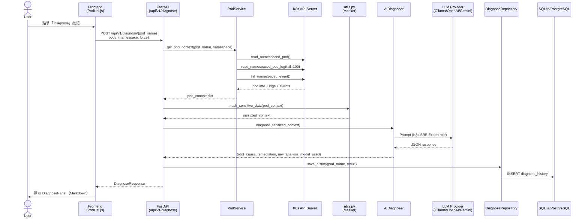
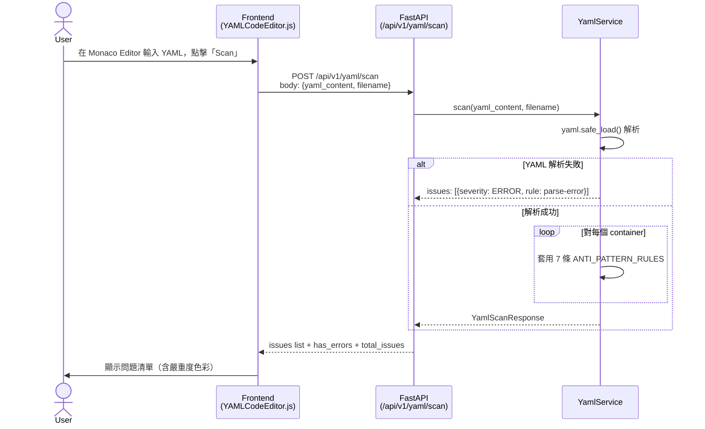
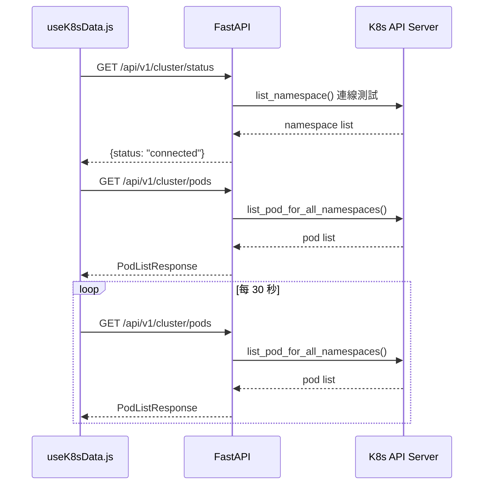
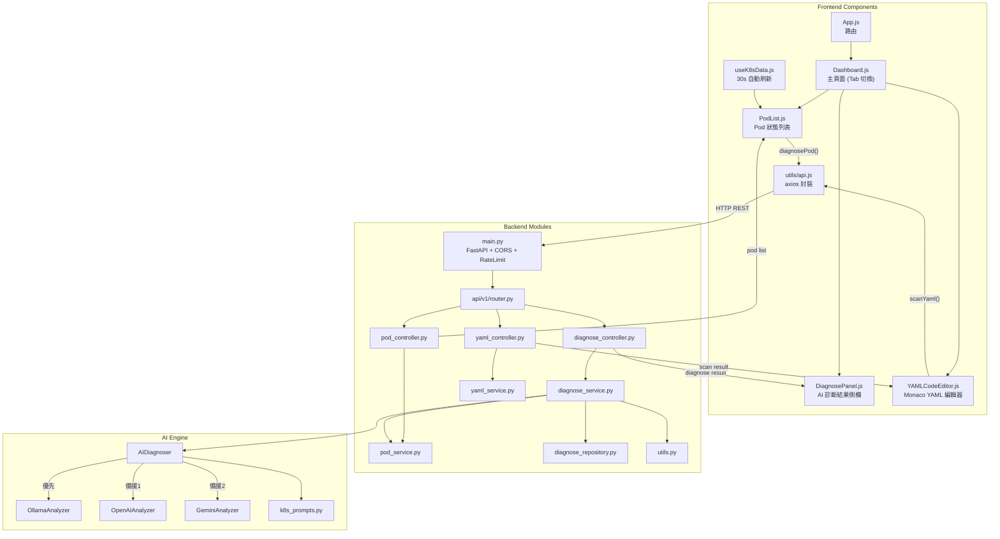
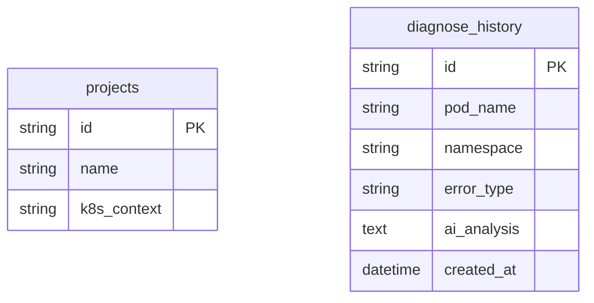

# 🦞 Lobster K8s Copilot - 系統詳細設計文件 (SD)

> **版本**：v2.0 | **更新日期**：2026-03-06 | **依據**：實際程式碼 (commit: main)

---

## 1. 完整 API Endpoint 列表 (API Reference)

Base URL：`http://<host>:8000`  
API Prefix：`/api/v1`

### 1.1 系統健康

| Method | Path | 說明 | Response |
|--------|------|------|----------|
| `GET` | `/` | 服務健康確認 | `{"message": "Lobster K8s Copilot API is running", "version": "1.0.0"}` |

### 1.2 叢集管理 (Cluster)

| Method | Path | 說明 | Query Params | Response Schema |
|--------|------|------|-------------|-----------------|
| `GET` | `/api/v1/cluster/status` | K8s 叢集連線狀態 | — | `{"status": "connected"\|"disconnected", "error": string\|null}` |
| `GET` | `/api/v1/cluster/pods` | 列出所有 Pod | `namespace` (optional, string) | `PodListResponse` |

### 1.3 AI 診斷 (Diagnose)

| Method | Path | 說明 | Request Body | Response Schema |
|--------|------|------|-------------|-----------------|
| `POST` | `/api/v1/diagnose/{pod_name}` | 觸發 AI 診斷 | `DiagnoseRequest` | `DiagnoseResponse` |
| `GET` | `/api/v1/diagnose/history` | 取得所有診斷歷史（最近 50 筆）| — | `List[DiagnoseHistoryRecord]` |
| `GET` | `/api/v1/diagnose/history/{pod_name}` | 取得指定 Pod 診斷歷史 | — | `List[DiagnoseHistoryRecord]` |

### 1.4 YAML 管理 (YAML)

| Method | Path | 說明 | Request Body | Response Schema |
|--------|------|------|-------------|-----------------|
| `POST` | `/api/v1/yaml/scan` | YAML 靜態掃描 | `YamlScanRequest` | `YamlScanResponse` |
| `POST` | `/api/v1/yaml/diff` | 比對兩份 YAML | `{"yaml_a": string, "yaml_b": string}` | `dict`（DeepDiff 結果）|

---

## 2. 資料結構定義 (Data Structures)

### 2.1 Pydantic 請求 / 回應模型

```python
# ── Pod ─────────────────────────────────────────────────────────────
class PodInfo(BaseModel):
    name: str
    namespace: str
    status: Optional[str]          # "Running" | "Pending" | "Failed" | "Unknown"
    ip: Optional[str]
    conditions: Optional[List[dict]] = []

class PodListResponse(BaseModel):
    pods: List[PodInfo]
    total: int

# ── Diagnose ─────────────────────────────────────────────────────────
class DiagnoseRequest(BaseModel):
    namespace: str = "default"
    force: bool = False            # True = 跳過快取，強制重新診斷

class DiagnoseResponse(BaseModel):
    pod_name: str
    namespace: str
    error_type: Optional[str]      # "CrashLoopBackOff" | "OOMKilled" | ...
    root_cause: str
    remediation: str
    raw_analysis: str
    model_used: str                # "ollama/llama3" | "gpt-4o" | "gemini-1.5-pro"

class DiagnoseHistoryRecord(BaseModel):
    id: str                        # UUID
    pod_name: str
    namespace: str
    error_type: Optional[str]
    ai_analysis: Optional[str]     # JSON string
    created_at: datetime

# ── YAML ─────────────────────────────────────────────────────────────
class YamlScanRequest(BaseModel):
    yaml_content: str
    filename: Optional[str] = "manifest.yaml"

class YamlIssue(BaseModel):
    severity: str                  # "ERROR" | "WARNING" | "INFO"
    rule: str                      # 規則 ID（見下方靜態分析規則）
    message: str
    line: Optional[int] = None

class YamlScanResponse(BaseModel):
    filename: str
    issues: List[YamlIssue]
    total_issues: int
    has_errors: bool
    ai_suggestions: Optional[str] = None
```

### 2.2 SQLAlchemy ORM 模型

```python
class Project(Base):
    __tablename__ = "projects"
    id: str            # UUID, Primary Key
    name: str          # 專案名稱
    k8s_context: str   # K8s context 名稱

class DiagnoseHistory(Base):
    __tablename__ = "diagnose_history"
    id: str            # UUID, Primary Key
    pod_name: str      # Pod 名稱
    namespace: str     # 命名空間，預設 "default"
    error_type: str    # 錯誤類型（nullable）
    ai_analysis: str   # AI 分析結果，JSON 字串（nullable）
    created_at: datetime  # 建立時間，自動填入
```

### 2.3 AI Engine 資料結構

**Diagnoser 輸入（Pod Context）：**
```python
{
    "pod_name": str,
    "namespace": str,
    "error_type": str,     # 從 Pod status 推斷
    "describe": str,       # kubectl describe pod 輸出
    "logs": str            # 最後 100 行 logs
}
```

**Diagnoser 輸出：**
```python
{
    "root_cause": str,       # 根本原因描述
    "remediation": str,      # 修復建議（含指令）
    "raw_analysis": str,     # LLM 完整回應
    "model_used": str        # 實際使用的模型名稱
}
```

---

## 3. YAML 靜態分析規則 (Static Analysis Rules)

| 規則 ID | 嚴重度 | 檢查項目 | 訊息 |
|---------|--------|----------|------|
| `no-resource-limits` | `ERROR` | 容器缺少 `resources.limits` | CPU/Memory limits 缺失，有 OOM 風險 |
| `no-resource-requests` | `WARNING` | 容器缺少 `resources.requests` | Requests 缺失，影響 K8s 排程品質 |
| `privileged-container` | `ERROR` | `securityContext.privileged == true` | 特權容器，高安全風險 |
| `run-as-root` | `ERROR` | `securityContext.runAsNonRoot == false` | 以 root 執行，有提權風險 |
| `no-liveness-probe` | `WARNING` | 容器缺少 `livenessProbe` | 無法自動偵測並重啟故障容器 |
| `no-readiness-probe` | `WARNING` | 容器缺少 `readinessProbe` | 無法正確控制流量路由 |
| `latest-image-tag` | `WARNING` | Image tag 為 `:latest` 或無 tag | 不可預期的部署行為 |

**支援的 K8s Kind：**
`Deployment`、`DaemonSet`、`StatefulSet`、`ReplicaSet`、`Pod`、`CronJob`、`Job`

---

## 4. 系統流程圖 (System Flow Diagrams)

### 4.1 AI 診斷完整流程



### 4.2 YAML 掃描流程



### 4.3 Pod 列表自動刷新流程



---

## 5. 元件互動關係 (Component Interaction)



---

## 6. 資料庫設計 (Database Schema)

### Table: `projects`

| 欄位 | 型別 | 限制 | 說明 |
|------|------|------|------|
| `id` | VARCHAR(36) | PK, NOT NULL | UUID |
| `name` | VARCHAR | NOT NULL | 專案名稱 |
| `k8s_context` | VARCHAR | NOT NULL | K8s context 名稱 |

### Table: `diagnose_history`

| 欄位 | 型別 | 限制 | 說明 |
|------|------|------|------|
| `id` | VARCHAR(36) | PK, NOT NULL | UUID |
| `pod_name` | VARCHAR | NOT NULL | Pod 名稱 |
| `namespace` | VARCHAR | NOT NULL, DEFAULT 'default' | 命名空間 |
| `error_type` | VARCHAR | NULL | 錯誤類型 |
| `ai_analysis` | TEXT | NULL | AI 分析結果（JSON 字串）|
| `created_at` | TIMESTAMP | NOT NULL, DEFAULT now() | 建立時間 |



---

## 7. 安全與容錯設計 (Security & Fault Tolerance)

### 7.1 敏感資料遮罩

`utils.py` 在 Pod context 送至 LLM **之前**執行遮罩：

```python
SENSITIVE_PATTERNS = [
    r'(?i)(password\s*[=:]\s*)\S+',
    r'(?i)(token\s*[=:]\s*)\S+',
    r'(?i)(secret\s*[=:]\s*)\S+',
    r'(?i)(api[_-]?key\s*[=:]\s*)\S+',
    r'(?i)(bearer\s+)\S+',
    r'(?i)(basic\s+)\S+',
]
# 匹配值替換為 [MASKED]
```

### 7.2 LLM 降級策略

| 情境 | 行為 |
|------|------|
| Ollama 無法連線 | 自動切換 OpenAI |
| OpenAI 金鑰未設定 | 自動切換 Gemini |
| 所有 Provider 不可用 | 回傳包含錯誤訊息的結構化 JSON |
| LLM 回傳非 JSON | `_parse_response()` 嘗試從 Markdown code fence 提取 JSON |

### 7.3 K8s 連線策略

```python
# main.py 啟動時執行
try:
    config.load_incluster_config()   # 在 K8s 叢集內執行時
except ConfigException:
    config.load_kube_config()        # 本機開發使用 ~/.kube/config
```

---

## 8. 測試設計 (Test Design)

### 測試覆蓋範圍

| 測試檔案 | 測試對象 | 測試數量 |
|---------|---------|---------|
| `test_endpoints.py` | FastAPI 端到端 API 測試 | 5 個 |
| `test_diagnoser.py` | AI Engine 單元測試 | 4 個 |
| `test_yaml_service.py` | YAML 掃描/Diff 邏輯測試 | 9 個 |
| `test_utils.py` | 敏感資料遮罩測試 | 6 個 |

### 測試基礎設施 (conftest.py)

```python
@pytest.fixture(autouse=True)
def patch_k8s():
    """自動 mock K8s config 載入，使測試可離線執行"""
    with patch("kubernetes.config.load_incluster_config"), \
         patch("kubernetes.config.load_kube_config"):
        yield

@pytest.fixture
def client():
    """提供 FastAPI TestClient，K8s 已 mock"""
    return TestClient(app)
```

---

## 9. Kubernetes 整合詳情 (K8s Integration)

### 使用的 K8s API

| API 呼叫 | 用途 |
|----------|------|
| `CoreV1Api.list_pod_for_all_namespaces()` | 列出所有命名空間的 Pod |
| `CoreV1Api.list_namespaced_pod(namespace)` | 列出指定命名空間的 Pod |
| `CoreV1Api.read_namespaced_pod(name, namespace)` | 取得 Pod 詳細資訊（describe）|
| `CoreV1Api.read_namespaced_pod_log(name, namespace, tail_lines=100)` | 取得 Pod 最後 100 行 logs |
| `CoreV1Api.list_namespaced_event(namespace, field_selector)` | 取得 Pod 相關 Events |
| `CoreV1Api.list_namespace()` | 測試叢集連線狀態 |

---

*文件版本：v2.0 | 更新日期：2026-03-06 | 撰寫依據：實際程式碼*
