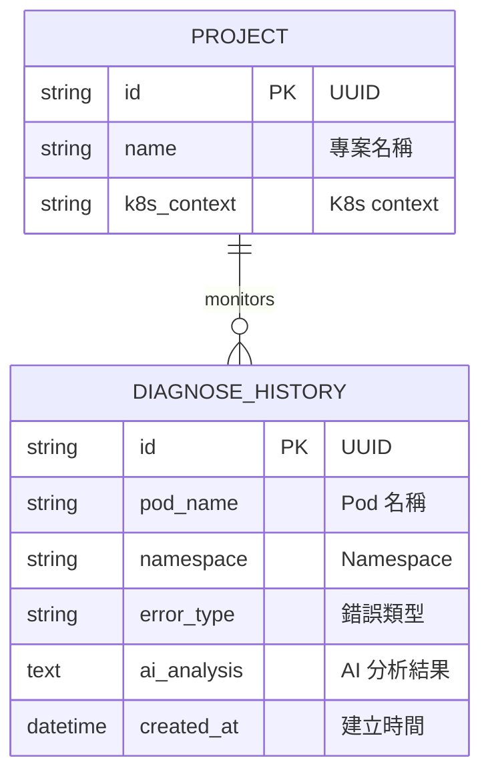
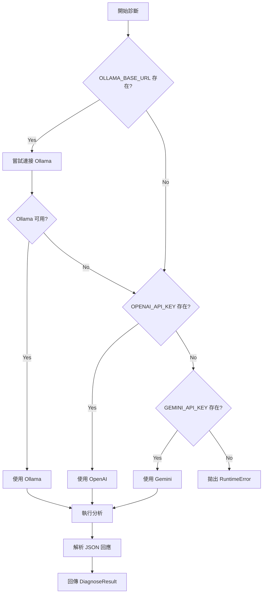

# 🦞 Lobster K8s Copilot - 系統設計文件 (SD)

> **Version**: 1.0.0 | **Status**: Production Ready | **Last Updated**: 2026-03-07

---

## 1. API 設計 (API Design)

### 1.1 API 概覽

| 版本 | 前綴 | 認證 |
|------|------|------|
| v1 | `/api/v1` | Optional API Key |

### 1.2 端點定義

#### 1.2.1 健康檢查

```
GET /
```

**Response** `200 OK`:
```json
{
  "message": "Lobster K8s Copilot API is running",
  "version": "1.0.0"
}
```

---

#### 1.2.2 叢集狀態

```
GET /api/v1/cluster/status
```

**Response** `200 OK`:
```json
{
  "status": "connected",  // "connected" | "disconnected"
  "error": null           // string | null
}
```

---

#### 1.2.3 列出 Pods

```
GET /api/v1/cluster/pods
```

**Query Parameters**:
| 參數 | 類型 | 必填 | 說明 |
|------|------|------|------|
| `namespace` | string | 否 | 過濾特定 namespace |

**Response** `200 OK`:
```json
{
  "pods": [
    {
      "name": "nginx-deployment-5d4d4c7b8-abc12",
      "namespace": "default",
      "status": "Running",
      "ip": "10.244.0.15",
      "conditions": [
        {
          "type": "Ready",
          "status": "True"
        }
      ]
    }
  ],
  "total": 1
}
```

---

#### 1.2.4 AI 診斷 Pod

```
POST /api/v1/diagnose/{pod_name}
```

**Path Parameters**:
| 參數 | 類型 | 說明 |
|------|------|------|
| `pod_name` | string | Kubernetes Pod 名稱 (DNS-1123 subdomain) |

**Request Body**:
```json
{
  "namespace": "default",  // string, default: "default"
  "force": false           // boolean, 強制重新診斷
}
```

**Response** `200 OK`:
```json
{
  "pod_name": "nginx-deployment-5d4d4c7b8-abc12",
  "namespace": "default",
  "error_type": "CrashLoopBackOff",
  "root_cause": "Container failed to start due to missing configuration file",
  "detailed_analysis": "The container is trying to read /etc/config/app.yaml which does not exist...",
  "remediation": "Create a ConfigMap with the required configuration:\n\nkubectl create configmap app-config --from-file=app.yaml",
  "raw_analysis": "...",
  "model_used": "gpt-4"
}
```

**Error Responses**:
| Code | Description |
|------|-------------|
| `404` | Pod not found |
| `422` | Invalid pod name format |
| `500` | Diagnosis failed |

---

#### 1.2.5 診斷歷史

```
GET /api/v1/diagnose/history
```

**Response** `200 OK`:
```json
[
  {
    "id": "550e8400-e29b-41d4-a716-446655440000",
    "pod_name": "nginx-deployment-5d4d4c7b8-abc12",
    "namespace": "default",
    "error_type": "CrashLoopBackOff",
    "ai_analysis": "...",
    "created_at": "2026-03-07T08:00:00Z"
  }
]
```

---

#### 1.2.6 特定 Pod 診斷歷史

```
GET /api/v1/diagnose/history/{pod_name}
```

**Path Parameters**:
| 參數 | 類型 | 說明 |
|------|------|------|
| `pod_name` | string | Kubernetes Pod 名稱 |

**Response** `200 OK`:
```json
[
  {
    "id": "550e8400-e29b-41d4-a716-446655440000",
    "pod_name": "nginx-deployment-5d4d4c7b8-abc12",
    "namespace": "default",
    "error_type": "CrashLoopBackOff",
    "ai_analysis": "...",
    "created_at": "2026-03-07T08:00:00Z"
  }
]
```

---

#### 1.2.7 YAML 掃描

```
POST /api/v1/yaml/scan
```

**Request Body**:
```json
{
  "yaml_content": "apiVersion: apps/v1\nkind: Deployment\n...",
  "filename": "deployment.yaml"  // optional, default: "manifest.yaml"
}
```

**Constraints**:
- `yaml_content` 最大 512 KB

**Response** `200 OK`:
```json
{
  "filename": "deployment.yaml",
  "issues": [
    {
      "severity": "ERROR",
      "rule": "no-resource-limits",
      "message": "Container 'nginx' is missing CPU/Memory resource limits. Set resources.limits to prevent OOM.",
      "line": null
    },
    {
      "severity": "WARNING",
      "rule": "no-liveness-probe",
      "message": "Container 'nginx' has no livenessProbe. Add a livenessProbe for automatic recovery.",
      "line": null
    }
  ],
  "total_issues": 2,
  "has_errors": true,
  "ai_suggestions": "To fix these issues:\n\n1. Add resource limits..."
}
```

---

#### 1.2.8 YAML 差異比較

```
POST /api/v1/yaml/diff
```

**Request Body**:
```json
{
  "yaml_a": "apiVersion: apps/v1\nkind: Deployment\n...",
  "yaml_b": "apiVersion: apps/v1\nkind: Deployment\n..."
}
```

**Constraints**:
- 每個 YAML 最大 512 KB

**Response** `200 OK`:
```json
{
  "values_changed": {
    "root['spec']['replicas']": {
      "new_value": 3,
      "old_value": 1
    }
  },
  "dictionary_item_added": {
    "root['metadata']['labels']['env']": "production"
  }
}
```

---

## 2. 資料庫設計 (Database Design)

### 2.1 ER Diagram



### 2.2 Table Schema

#### 2.2.1 `projects` 表

```sql
CREATE TABLE projects (
    id VARCHAR PRIMARY KEY DEFAULT uuid_generate_v4(),
    name VARCHAR NOT NULL,
    k8s_context VARCHAR NOT NULL
);
```

| Column | Type | Nullable | Description |
|--------|------|----------|-------------|
| `id` | VARCHAR | NO | Primary Key (UUID) |
| `name` | VARCHAR | NO | 專案名稱 |
| `k8s_context` | VARCHAR | NO | Kubernetes context 名稱 |

---

#### 2.2.2 `diagnose_history` 表

```sql
CREATE TABLE diagnose_history (
    id VARCHAR PRIMARY KEY DEFAULT uuid_generate_v4(),
    pod_name VARCHAR NOT NULL,
    namespace VARCHAR NOT NULL DEFAULT 'default',
    error_type VARCHAR,
    ai_analysis TEXT,
    created_at TIMESTAMP DEFAULT CURRENT_TIMESTAMP
);

CREATE INDEX ix_diagnose_history_pod_name ON diagnose_history(pod_name);
CREATE INDEX ix_diagnose_history_created_at ON diagnose_history(created_at);
CREATE INDEX ix_diagnose_history_pod_namespace ON diagnose_history(pod_name, namespace);
```

| Column | Type | Nullable | Default | Description |
|--------|------|----------|---------|-------------|
| `id` | VARCHAR | NO | UUID | Primary Key |
| `pod_name` | VARCHAR | NO | - | Pod 名稱 |
| `namespace` | VARCHAR | NO | 'default' | Kubernetes namespace |
| `error_type` | VARCHAR | YES | NULL | 錯誤類型 (如 CrashLoopBackOff) |
| `ai_analysis` | TEXT | YES | NULL | AI 診斷結果 (JSON string) |
| `created_at` | TIMESTAMP | NO | NOW() | 建立時間 |

**Indexes**:
- `ix_diagnose_history_pod_name`: 加速 pod 查詢
- `ix_diagnose_history_created_at`: 加速時間排序
- `ix_diagnose_history_pod_namespace`: 複合索引加速聯合查詢

---

## 3. Pydantic Models

### 3.1 Request Models

```python
class DiagnoseRequest(BaseModel):
    namespace: str = "default"
    force: bool = False

    @field_validator("namespace")
    @classmethod
    def validate_namespace(cls, v: str) -> str:
        if not K8S_NAME_RE.match(v):
            raise ValueError("Invalid Kubernetes namespace name")
        return v


class YamlScanRequest(BaseModel):
    yaml_content: str
    filename: str | None = "manifest.yaml"

    @field_validator("yaml_content")
    @classmethod
    def validate_yaml_size(cls, v: str) -> str:
        if len(v.encode("utf-8")) > 512 * 1024:
            raise ValueError("yaml_content exceeds 512 KB")
        return v
```

### 3.2 Response Models

```python
class PodInfo(BaseModel):
    name: str
    namespace: str
    status: str | None
    ip: str | None
    conditions: list[dict] = []


class PodListResponse(BaseModel):
    pods: list[PodInfo]
    total: int


class DiagnoseResponse(BaseModel):
    pod_name: str
    namespace: str
    error_type: str | None
    root_cause: str
    detailed_analysis: str | None = None
    remediation: str
    raw_analysis: str
    model_used: str


class YamlIssue(BaseModel):
    severity: Literal["ERROR", "WARNING", "INFO"]
    rule: str
    message: str
    line: int | None = None


class YamlScanResponse(BaseModel):
    filename: str
    issues: list[YamlIssue]
    total_issues: int
    has_errors: bool
    ai_suggestions: str | None = None


class DiagnoseHistoryRecord(BaseModel):
    id: str
    pod_name: str
    namespace: str
    error_type: str | None
    ai_analysis: str | None
    created_at: datetime

    model_config = {"from_attributes": True}
```

---

## 4. YAML Anti-Pattern Rules

### 4.1 規則定義

| Rule ID | Severity | 說明 |
|---------|----------|------|
| `no-resource-limits` | ERROR | Container 缺少 CPU/Memory limits |
| `no-resource-requests` | WARNING | Container 缺少 resource requests |
| `privileged-container` | ERROR | Container 以 privileged 模式運行 |
| `run-as-root` | ERROR | Container 可能以 root 運行 |
| `no-liveness-probe` | WARNING | 缺少 livenessProbe |
| `no-readiness-probe` | WARNING | 缺少 readinessProbe |
| `latest-image-tag` | WARNING | 使用 :latest tag |
| `ingress-nginx-deprecation` | ERROR | 使用已棄用的 ingress-nginx |

### 4.2 規則檢查邏輯

```python
@dataclass(frozen=True)
class AntiPatternRule:
    id: str
    severity: Literal["ERROR", "WARNING", "INFO"]
    message: str
    check: Callable[[dict[str, Any]], bool]

# Example rule
AntiPatternRule(
    id="no-resource-limits",
    severity="ERROR",
    message="Container '{container}' is missing CPU/Memory resource limits.",
    check=lambda c: not (c.get("resources", {}).get("limits")),
)
```

---

## 5. AI Diagnoser 設計

### 5.1 Provider 選擇流程



### 5.2 Prompt 模板

```python
DIAGNOSE_PROMPT_TEMPLATE = """
You are a Kubernetes expert. Analyze the following pod failure and provide:
1. Root cause analysis
2. Detailed technical explanation
3. Remediation steps

Pod: {pod_name}
Namespace: {namespace}
Error Type: {error_type}

kubectl describe output:
{describe}

Pod logs:
{logs}

Respond in JSON format:
{{
  "root_cause": "Brief root cause",
  "detailed_analysis": "Technical explanation",
  "remediation": "Step-by-step fix"
}}
"""
```

---

## 6. 錯誤處理設計

### 6.1 HTTP 狀態碼

| Code | 使用場景 |
|------|----------|
| `200` | 成功 |
| `400` | Bad Request (無效路徑) |
| `401` | Unauthorized (無效 API Key) |
| `404` | Resource Not Found (Pod 不存在) |
| `422` | Validation Error (格式錯誤、大小超限) |
| `429` | Rate Limit Exceeded |
| `500` | Internal Server Error |

### 6.2 錯誤回應格式

```json
{
  "detail": "Human-readable error message"
}
```

---

## 7. 環境變數

| 變數 | 類型 | 必填 | 預設值 | 說明 |
|------|------|------|--------|------|
| `DATABASE_URL` | string | No | `sqlite:///./lobster.db` | 資料庫連線 |
| `LOBSTER_API_KEY` | string | No | - | API 認證金鑰 |
| `ALLOWED_ORIGINS` | string | No | - | CORS 白名單 (逗號分隔) |
| `OPENAI_API_KEY` | string | No | - | OpenAI API Key |
| `GEMINI_API_KEY` | string | No | - | Gemini API Key |
| `OLLAMA_BASE_URL` | string | No | `http://localhost:11434` | Ollama 端點 |
| `OLLAMA_MODEL` | string | No | `llama3` | Ollama 模型名稱 |
| `AI_ENGINE_URL` | string | No | - | AI Engine 微服務 URL |
| `FRONTEND_BUILD_DIR` | string | No | `frontend/build` | 前端靜態檔案目錄 |

---

## 8. 測試覆蓋

### 8.1 測試模組

| 模組 | 測試檔案 | 測試數 |
|------|----------|--------|
| AI Diagnoser | `test_diagnoser.py` | 13 |
| API Endpoints | `test_endpoints.py` | 17 |
| Utils | `test_utils.py` | 18 |
| YAML Service | `test_yaml_service.py` | 14 |
| **Total** | - | **80** |

### 8.2 執行測試

```bash
# 執行所有測試
python3 -m pytest tests/ -v

# 執行特定測試
python3 -m pytest tests/test_yaml_service.py -v

# 產生覆蓋率報告
python3 -m pytest tests/ --cov=backend --cov-report=html
```

---

*文件建立日期：2026-03-07*  
*撰寫者：System Designer (Lobster Team)*
