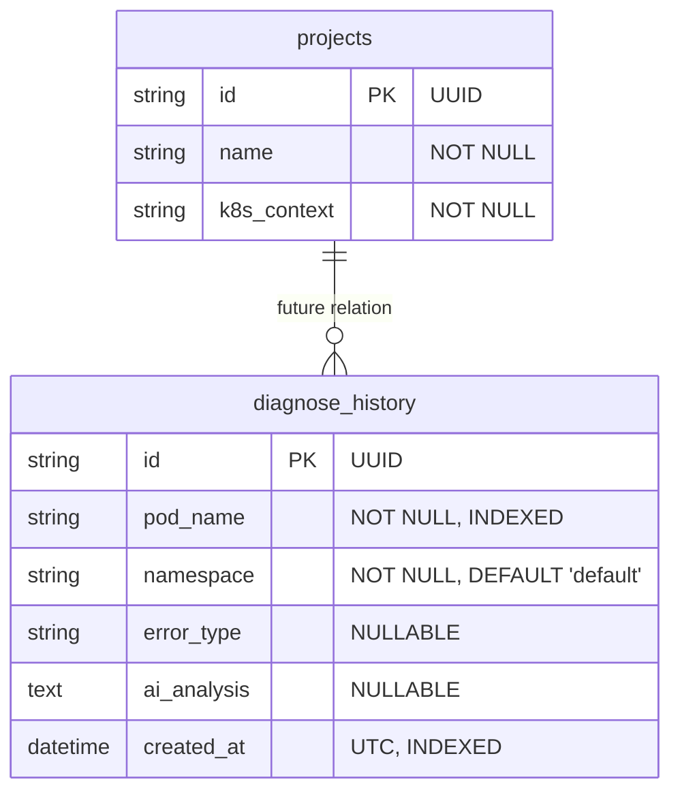
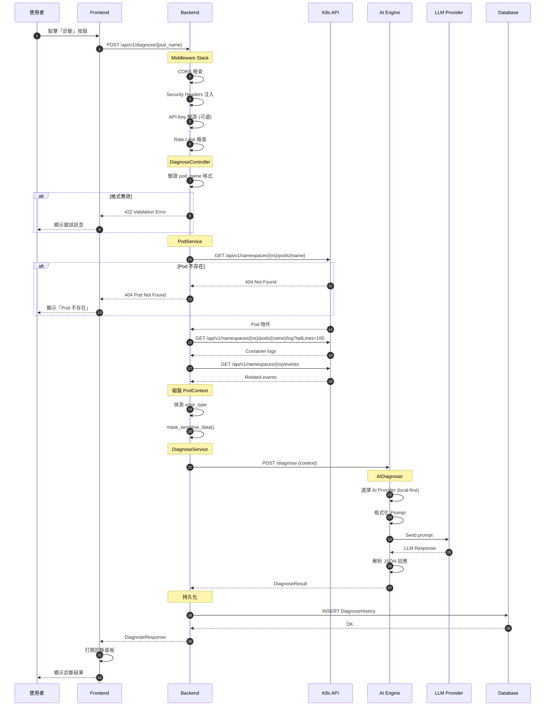
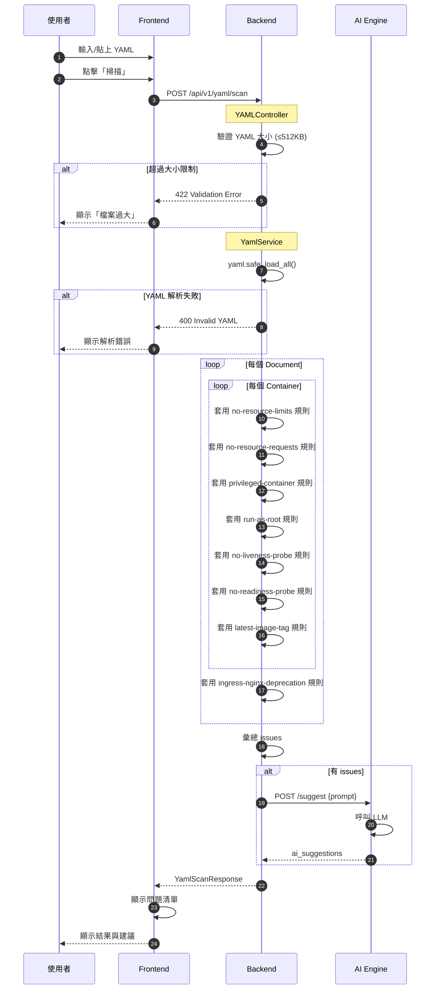
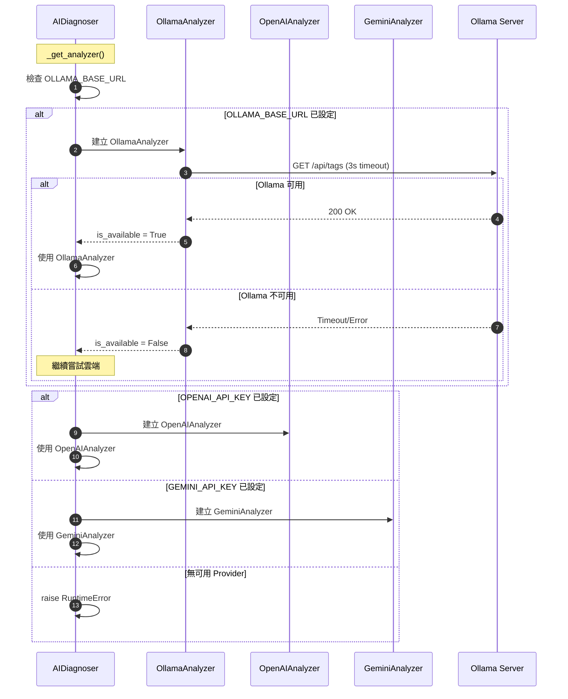

# 🦞 Lobster K8s Copilot - System Design (SD)

> **版本**: 1.0.0  
> **最後更新**: 2026-03-07  
> **狀態**: APPROVED

---

## 1. API 定義

### 1.1 API 總覽

| 版本 | Base Path | 格式 | 認證 |
|------|-----------|------|------|
| v1 | `/api/v1` | JSON | 可選 API Key |

**認證方式**:
- Header: `X-API-Key: <api_key>` 或 `Authorization: Bearer <api_key>`
- 設定 `LOBSTER_API_KEY` 環境變數啟用認證

**錯誤回應格式**:
```json
{
  "detail": "錯誤描述"
}
```

**HTTP 狀態碼**:

| 狀態碼 | 意義 |
|--------|------|
| 200 | 成功 |
| 400 | 請求格式錯誤 |
| 401 | 未授權 |
| 404 | 資源不存在 |
| 422 | 驗證失敗 |
| 429 | 請求過於頻繁 |
| 500 | 伺服器內部錯誤 |

---

### 1.2 Cluster API

#### GET / - 健康檢查

**描述**: 系統健康檢查與版本資訊

**Request**:
```http
GET / HTTP/1.1
Host: localhost:8000
```

**Response** (200 OK):
```json
{
  "status": "ok",
  "version": "1.0.0",
  "service": "Lobster K8s Copilot API"
}
```

---

#### GET /api/v1/cluster/status - 叢集連線狀態

**描述**: 檢查後端與 Kubernetes API 的連線狀態

**Request**:
```http
GET /api/v1/cluster/status HTTP/1.1
Host: localhost:8000
```

**Response** (200 OK):
```json
{
  "status": "connected",
  "version": "v1.28.0",
  "message": null
}
```

**Response Schema**:
```typescript
interface ClusterStatusResponse {
  status: "connected" | "disconnected";
  version: string | null;        // K8s server version (null if disconnected)
  message: string | null;        // Error message if disconnected
}
```

---

#### GET /api/v1/cluster/pods - 列出所有 Pod

**描述**: 取得叢集中所有 Pod 或指定 namespace 的 Pod 列表

**Request**:
```http
GET /api/v1/cluster/pods?namespace=default HTTP/1.1
Host: localhost:8000
```

**Query Parameters**:
| 參數 | 類型 | 必填 | 說明 |
|------|------|------|------|
| `namespace` | string | 否 | 過濾指定 namespace，空值表示全部 |

**Response** (200 OK):
```json
{
  "pods": [
    {
      "name": "nginx-deployment-5d77f8b4d5-abc12",
      "namespace": "default",
      "status": "Running",
      "ip": "10.244.0.5",
      "conditions": [
        {
          "type": "Ready",
          "status": "True",
          "lastTransitionTime": "2026-03-07T09:00:00Z"
        }
      ]
    }
  ],
  "total": 1
}
```

**Response Schema**:
```typescript
interface PodListResponse {
  pods: PodInfo[];
  total: number;
}

interface PodInfo {
  name: string;
  namespace: string;
  status: string | null;         // Running, Pending, Failed, etc.
  ip: string | null;
  conditions: PodCondition[];
}

interface PodCondition {
  type: string;
  status: string;
  lastTransitionTime?: string;
  reason?: string;
  message?: string;
}
```

---

### 1.3 Diagnose API

#### POST /api/v1/diagnose/{pod_name} - AI 診斷 Pod

**描述**: 對指定 Pod 執行 AI 故障診斷，自動收集 describe、logs、events 並分析

**Request**:
```http
POST /api/v1/diagnose/nginx-deployment-5d77f8b4d5-abc12 HTTP/1.1
Host: localhost:8000
Content-Type: application/json

{
  "namespace": "default",
  "force": false
}
```

**Path Parameters**:
| 參數 | 類型 | 必填 | 說明 |
|------|------|------|------|
| `pod_name` | string | 是 | Pod 名稱 (K8s DNS-subdomain 格式) |

**Request Body**:
```typescript
interface DiagnoseRequest {
  namespace: string;    // 預設 "default"，必須符合 K8s 命名規則
  force: boolean;       // 預設 false，強制重新診斷 (忽略快取)
}
```

**Response** (200 OK):
```json
{
  "pod_name": "nginx-deployment-5d77f8b4d5-abc12",
  "namespace": "default",
  "error_type": "CrashLoopBackOff",
  "root_cause": "Application failed to connect to database at startup",
  "detailed_analysis": "The container crashed due to a connection timeout when attempting to connect to MySQL database. The database service appears to be unavailable or the credentials may be incorrect.",
  "remediation": "1. Check if the MySQL service is running\n2. Verify database credentials in the ConfigMap\n3. Check network policies",
  "raw_analysis": "{ ... full LLM response ... }",
  "model_used": "ollama:llama3"
}
```

**Response Schema**:
```typescript
interface DiagnoseResponse {
  pod_name: string;
  namespace: string;
  error_type: string | null;          // CrashLoopBackOff, OOM, ImagePullBackOff, etc.
  root_cause: string;                 // AI 分析的根因
  detailed_analysis: string | null;   // 詳細分析 (可能為 null)
  remediation: string;                // 修復建議
  raw_analysis: string;               // 原始 LLM 輸出
  model_used: string;                 // 使用的 AI 模型
}
```

**Error Responses**:
- 404: Pod 不存在
- 422: Pod 名稱格式不符合 K8s 命名規則
- 500: 診斷失敗

---

#### GET /api/v1/diagnose/history - 查詢診斷歷史

**描述**: 取得所有診斷歷史記錄，按時間降序排列

**Request**:
```http
GET /api/v1/diagnose/history?limit=50 HTTP/1.1
Host: localhost:8000
```

**Query Parameters**:
| 參數 | 類型 | 必填 | 說明 |
|------|------|------|------|
| `limit` | integer | 否 | 最多回傳筆數，預設 50 |

**Response** (200 OK):
```json
[
  {
    "id": "550e8400-e29b-41d4-a716-446655440000",
    "pod_name": "nginx-deployment-5d77f8b4d5-abc12",
    "namespace": "default",
    "error_type": "CrashLoopBackOff",
    "ai_analysis": "{ ... }",
    "created_at": "2026-03-07T09:15:00.000Z"
  }
]
```

**Response Schema**:
```typescript
interface DiagnoseHistoryRecord {
  id: string;                    // UUID
  pod_name: string;
  namespace: string;
  error_type: string | null;
  ai_analysis: string | null;    // JSON string of full analysis
  created_at: string;            // ISO 8601 timestamp
}
```

---

#### GET /api/v1/diagnose/history/{pod_name} - 查詢特定 Pod 歷史

**描述**: 取得指定 Pod 的所有診斷歷史記錄

**Request**:
```http
GET /api/v1/diagnose/history/nginx-deployment-5d77f8b4d5-abc12 HTTP/1.1
Host: localhost:8000
```

**Path Parameters**:
| 參數 | 類型 | 必填 | 說明 |
|------|------|------|------|
| `pod_name` | string | 是 | Pod 名稱 |

**Response** (200 OK):
```json
[
  {
    "id": "550e8400-e29b-41d4-a716-446655440000",
    "pod_name": "nginx-deployment-5d77f8b4d5-abc12",
    "namespace": "default",
    "error_type": "CrashLoopBackOff",
    "ai_analysis": "{ ... }",
    "created_at": "2026-03-07T09:15:00.000Z"
  }
]
```

---

### 1.4 YAML API

#### POST /api/v1/yaml/scan - YAML 掃描

**描述**: 掃描 K8s YAML 配置，偵測 anti-pattern 並提供 AI 建議

**Request**:
```http
POST /api/v1/yaml/scan HTTP/1.1
Host: localhost:8000
Content-Type: application/json

{
  "yaml_content": "apiVersion: apps/v1\nkind: Deployment\n...",
  "filename": "nginx-deployment.yaml"
}
```

**Request Body**:
```typescript
interface YamlScanRequest {
  yaml_content: string;          // YAML 內容 (max 512 KB)
  filename: string | null;       // 檔案名稱，預設 "manifest.yaml"
}
```

**Response** (200 OK):
```json
{
  "filename": "nginx-deployment.yaml",
  "issues": [
    {
      "severity": "ERROR",
      "rule": "no-resource-limits",
      "message": "Container 'nginx' missing CPU/Memory limits",
      "line": 25
    },
    {
      "severity": "WARNING",
      "rule": "no-liveness-probe",
      "message": "Container 'nginx' missing livenessProbe",
      "line": 25
    }
  ],
  "total_issues": 2,
  "has_errors": true,
  "ai_suggestions": "## Recommendations\n\n1. Add resource limits to prevent OOM...\n2. Add livenessProbe to ensure pod health..."
}
```

**Response Schema**:
```typescript
interface YamlScanResponse {
  filename: string;
  issues: YamlIssue[];
  total_issues: number;
  has_errors: boolean;           // true if any ERROR severity issues
  ai_suggestions: string | null; // AI-generated fix suggestions
}

interface YamlIssue {
  severity: "ERROR" | "WARNING" | "INFO";
  rule: string;                  // Rule identifier
  message: string;               // Human-readable message
  line: number | null;           // Line number in YAML (if available)
}
```

**Anti-Pattern Rules**:

| Rule ID | Severity | 說明 |
|---------|----------|------|
| `no-resource-limits` | ERROR | Container 未設定 CPU/Memory limits |
| `no-resource-requests` | WARNING | Container 未設定 resource requests |
| `privileged-container` | ERROR | Container 以 privileged mode 運行 |
| `run-as-root` | ERROR | Container 可能以 root 運行 |
| `no-liveness-probe` | WARNING | 未設定 livenessProbe |
| `no-readiness-probe` | WARNING | 未設定 readinessProbe |
| `latest-image-tag` | WARNING | 使用 :latest tag |
| `ingress-nginx-deprecation` | ERROR | 使用即將淘汰的 ingress-nginx |

---

#### POST /api/v1/yaml/diff - YAML Diff

**描述**: 比對兩份 YAML 配置的差異

**Request**:
```http
POST /api/v1/yaml/diff HTTP/1.1
Host: localhost:8000
Content-Type: application/json

{
  "yaml_a": "apiVersion: apps/v1\nkind: Deployment\n...",
  "yaml_b": "apiVersion: apps/v1\nkind: Deployment\n..."
}
```

**Request Body**:
```typescript
interface YamlDiffRequest {
  yaml_a: string;    // 第一份 YAML (max 512 KB)
  yaml_b: string;    // 第二份 YAML (max 512 KB)
}
```

**Response** (200 OK):
```json
{
  "values_changed": {
    "root['spec']['replicas']": {
      "new_value": 3,
      "old_value": 2
    }
  },
  "iterable_item_added": {
    "root['spec']['template']['spec']['containers'][0]['env'][1]": {
      "name": "NEW_VAR",
      "value": "new_value"
    }
  },
  "iterable_item_removed": {}
}
```

**Response Schema** (DeepDiff 格式):
```typescript
interface YamlDiffResponse {
  values_changed?: Record<string, { old_value: any; new_value: any }>;
  iterable_item_added?: Record<string, any>;
  iterable_item_removed?: Record<string, any>;
  dictionary_item_added?: string[];
  dictionary_item_removed?: string[];
  type_changes?: Record<string, { old_type: string; new_type: string; old_value: any; new_value: any }>;
}
```

---

### 1.5 AI Engine Internal API

> **注意**: 此為內部服務間 API，不對外暴露

#### GET /health - 健康檢查

**Request**:
```http
GET /health HTTP/1.1
Host: ai-engine:8001
```

**Response** (200 OK):
```json
{
  "status": "ok"
}
```

---

#### POST /diagnose - AI 診斷

**Request**:
```http
POST /diagnose HTTP/1.1
Host: ai-engine:8001
Content-Type: application/json

{
  "pod_name": "nginx-deployment-5d77f8b4d5-abc12",
  "namespace": "default",
  "error_type": "CrashLoopBackOff",
  "describe": "Name: nginx-deployment-5d77f8b4d5-abc12\nNamespace: default\n...",
  "logs": "[ERROR] Failed to connect to database..."
}
```

**Request Body**:
```typescript
interface AIEngineRequest {
  pod_name: string;
  namespace: string;
  error_type: string;
  describe: string;              // kubectl describe output
  logs: string;                  // Container logs (last 100 lines)
}
```

**Response** (200 OK):
```json
{
  "root_cause": "...",
  "detailed_analysis": "...",
  "remediation": "...",
  "raw_analysis": "...",
  "model_used": "ollama:llama3"
}
```

---

#### POST /suggest - AI 建議

**Request**:
```http
POST /suggest HTTP/1.1
Host: ai-engine:8001
Content-Type: application/json

{
  "prompt": "Given these YAML issues, suggest fixes:\n..."
}
```

**Response** (200 OK):
```json
{
  "suggestion": "..."
}
```

---

## 2. Database Schema

### 2.1 ER Diagram



### 2.2 Table Definitions

#### projects

> **用途**: 儲存監控的 K8s 專案/叢集上下文 (未來擴展用)

```sql
CREATE TABLE projects (
    id VARCHAR PRIMARY KEY,          -- UUID v4
    name VARCHAR NOT NULL,           -- 專案名稱
    k8s_context VARCHAR NOT NULL     -- kubeconfig context 名稱
);
```

**Sample Data**:
```sql
INSERT INTO projects (id, name, k8s_context) VALUES
('550e8400-e29b-41d4-a716-446655440000', 'Production', 'prod-cluster');
```

---

#### diagnose_history

> **用途**: 儲存 AI 診斷歷史記錄

```sql
CREATE TABLE diagnose_history (
    id VARCHAR PRIMARY KEY,                              -- UUID v4
    pod_name VARCHAR NOT NULL,                           -- Pod 名稱
    namespace VARCHAR NOT NULL DEFAULT 'default',        -- Namespace
    error_type VARCHAR,                                  -- CrashLoopBackOff, OOM, etc.
    ai_analysis TEXT,                                    -- Full AI response (JSON)
    created_at DATETIME DEFAULT CURRENT_TIMESTAMP        -- 建立時間 (UTC)
);

-- Indexes
CREATE INDEX ix_diagnose_history_pod_name ON diagnose_history (pod_name);
CREATE INDEX ix_diagnose_history_created_at ON diagnose_history (created_at);
CREATE INDEX ix_diagnose_history_pod_namespace ON diagnose_history (pod_name, namespace);
```

**Sample Data**:
```sql
INSERT INTO diagnose_history (id, pod_name, namespace, error_type, ai_analysis, created_at) VALUES
('550e8400-e29b-41d4-a716-446655440001', 'nginx-5d77f8b4d5-abc12', 'default', 'CrashLoopBackOff', 
 '{"root_cause": "...", "remediation": "..."}', '2026-03-07T09:15:00.000Z');
```

---

### 2.3 ORM Model Mapping

```python
# backend/models/orm_models.py

class Project(Base):
    __tablename__ = "projects"
    
    id: Mapped[str] = mapped_column(String, primary_key=True, default=lambda: str(uuid.uuid4()))
    name: Mapped[str] = mapped_column(String, nullable=False)
    k8s_context: Mapped[str] = mapped_column(String, nullable=False)


class DiagnoseHistory(Base):
    __tablename__ = "diagnose_history"
    
    id: Mapped[str] = mapped_column(String, primary_key=True, default=lambda: str(uuid.uuid4()))
    pod_name: Mapped[str] = mapped_column(String, nullable=False, index=True)
    namespace: Mapped[str] = mapped_column(String, nullable=False, default="default")
    error_type: Mapped[str] = mapped_column(String, nullable=True)
    ai_analysis: Mapped[str] = mapped_column(Text, nullable=True)
    created_at: Mapped[datetime] = mapped_column(
        DateTime, default=lambda: datetime.now(timezone.utc), index=True
    )
    
    __table_args__ = (
        Index("ix_diagnose_history_pod_namespace", "pod_name", "namespace"),
    )
```

---

### 2.4 Migration Strategy

使用 Alembic 進行資料庫遷移：

```bash
# 產生遷移腳本
alembic revision --autogenerate -m "Add new column"

# 執行遷移
alembic upgrade head

# 回滾遷移
alembic downgrade -1
```

**遷移檔案結構**:
```
backend/migrations/
├── env.py
├── script.py.mako
└── versions/
    └── 001_initial.py
```

---

## 3. 錯誤處理策略

### 3.1 錯誤分類

| 類別 | HTTP 狀態碼 | 處理方式 |
|------|------------|---------|
| **驗證錯誤** | 422 | Pydantic 自動處理，返回詳細欄位錯誤 |
| **資源不存在** | 404 | 自訂 exception handler |
| **認證失敗** | 401 | Middleware 攔截 |
| **限流** | 429 | SlowAPI 處理 |
| **內部錯誤** | 500 | 全域 exception handler |

### 3.2 Exception Hierarchy

```python
# backend/utils.py

class LobsterException(Exception):
    """Base exception for Lobster K8s Copilot."""
    pass

class PodNotFoundError(LobsterException):
    """Raised when a requested pod does not exist."""
    pass

class YamlParseError(LobsterException):
    """Raised when YAML parsing fails."""
    pass

class AIProviderError(LobsterException):
    """Raised when AI provider is unavailable or fails."""
    pass
```

### 3.3 Error Response Format

```json
{
  "detail": "Pod 'nginx-abc12' not found in namespace 'default'",
  "error_code": "POD_NOT_FOUND",
  "timestamp": "2026-03-07T09:15:00.000Z"
}
```

### 3.4 Graceful Degradation

| 情境 | 降級策略 |
|------|---------|
| K8s API 不可用 | Pod 列表返回空陣列，狀態顯示 disconnected |
| AI Engine 不可用 | 診斷返回 partial result，提示重試 |
| AI 模型解析失敗 | 返回原始 LLM 輸出，客戶端自行解讀 |
| 資料庫寫入失敗 | 日誌記錄錯誤，診斷結果仍正常返回 |

---

## 4. 序列圖

### 4.1 完整診斷流程



### 4.2 YAML 掃描流程



### 4.3 AI 模型選擇流程



---

## 5. 模組介面定義

### 5.1 Controllers

#### PodController

```python
# backend/controllers/pod_controller.py

router = APIRouter()

@router.get("/pods", response_model=PodListResponse)
async def list_pods(
    namespace: str | None = Query(None, description="Filter by namespace")
) -> PodListResponse:
    """List all pods in the cluster or specific namespace."""
    ...
```

#### DiagnoseController

```python
# backend/controllers/diagnose_controller.py

router = APIRouter()

@router.post("/{pod_name}", response_model=DiagnoseResponse)
async def diagnose_pod(
    pod_name: str,
    request: DiagnoseRequest,
    db: Session = Depends(get_db)
) -> DiagnoseResponse:
    """Trigger AI diagnosis for a specific pod."""
    ...

@router.get("/history", response_model=list[DiagnoseHistoryRecord])
async def get_diagnose_history(
    limit: int = Query(50, ge=1, le=200),
    db: Session = Depends(get_db)
) -> list[DiagnoseHistoryRecord]:
    """Get all diagnosis history records."""
    ...

@router.get("/history/{pod_name}", response_model=list[DiagnoseHistoryRecord])
async def get_pod_diagnose_history(
    pod_name: str,
    db: Session = Depends(get_db)
) -> list[DiagnoseHistoryRecord]:
    """Get diagnosis history for a specific pod."""
    ...
```

#### YAMLController

```python
# backend/controllers/yaml_controller.py

router = APIRouter()

@router.post("/scan", response_model=YamlScanResponse)
async def scan_yaml(request: YamlScanRequest) -> YamlScanResponse:
    """Scan YAML manifest for anti-patterns."""
    ...

@router.post("/diff")
async def diff_yaml(
    yaml_a: str = Body(...),
    yaml_b: str = Body(...)
) -> dict:
    """Compare two YAML manifests."""
    ...
```

---

### 5.2 Services

#### PodService

```python
# backend/services/pod_service.py

class PodService:
    """Service for Kubernetes pod operations."""
    
    def list_pods(self, namespace: str | None = None) -> PodListResponse:
        """List all pods, optionally filtered by namespace."""
        ...
    
    def get_pod_context(self, pod_name: str, namespace: str = "default") -> PodContext:
        """Collect pod describe, logs, and events for diagnosis."""
        ...

class PodContext(TypedDict):
    pod_name: str
    namespace: str
    describe: str
    logs: str
    error_type: str
```

#### DiagnoseService

```python
# backend/services/diagnose_service.py

class DiagnoseService:
    """Service orchestrating AI pod diagnosis."""
    
    def __init__(self, db: Session):
        self.db = db
        self.pod_service = PodService()
    
    def diagnose(self, pod_name: str, namespace: str = "default") -> DiagnoseResponse:
        """Execute full diagnosis workflow."""
        ...
    
    def _call_ai_engine(self, context: PodContext) -> DiagnoseResult:
        """Call AI Engine via HTTP or local import."""
        ...
    
    def _persist_history(self, response: DiagnoseResponse) -> None:
        """Save diagnosis to database."""
        ...
```

#### YamlService

```python
# backend/services/yaml_service.py

class YamlService:
    """Service for YAML scanning and diffing."""
    
    def scan(self, yaml_content: str, filename: str = "manifest.yaml") -> YamlScanResponse:
        """Scan YAML for anti-patterns and get AI suggestions."""
        ...
    
    def diff(self, yaml_a: str, yaml_b: str) -> dict:
        """Compare two YAML documents using DeepDiff."""
        ...
    
    def _apply_rules(self, doc: dict) -> list[YamlIssue]:
        """Apply all anti-pattern rules to a K8s resource."""
        ...
    
    def _get_ai_suggestions(self, issues: list[YamlIssue], yaml_content: str) -> str | None:
        """Request AI-generated fix suggestions."""
        ...
```

---

### 5.3 Repositories

#### DiagnoseRepository

```python
# backend/repositories/diagnose_repository.py

class DiagnoseRepository:
    """Data access layer for diagnosis history."""
    
    @staticmethod
    def get_history(db: Session, limit: int = 50) -> list[DiagnoseHistoryRecord]:
        """Get recent diagnosis records."""
        ...
    
    @staticmethod
    def get_by_pod(db: Session, pod_name: str) -> list[DiagnoseHistoryRecord]:
        """Get all diagnosis records for a specific pod."""
        ...
    
    @staticmethod
    def create(db: Session, record: DiagnoseHistory) -> DiagnoseHistory:
        """Insert a new diagnosis record."""
        ...
```

---

### 5.4 AI Engine Interfaces

#### BaseAnalyzer

```python
# ai_engine/analyzers/base_analyzer.py

from abc import ABC, abstractmethod

class BaseAnalyzer(ABC):
    """Abstract base class for AI analyzers."""
    
    @abstractmethod
    def analyze(self, prompt: str) -> str:
        """Send prompt to LLM and return response text."""
        ...
    
    @property
    @abstractmethod
    def model_name(self) -> str:
        """Return the model identifier (e.g., 'ollama:llama3')."""
        ...
```

#### OllamaAnalyzer

```python
# ai_engine/analyzers/ollama_analyzer.py

class OllamaAnalyzer(BaseAnalyzer):
    """Ollama local LLM integration."""
    
    def __init__(self):
        self.base_url = os.getenv("OLLAMA_BASE_URL", "http://localhost:11434")
        self.model = os.getenv("OLLAMA_MODEL", "llama3")
    
    def is_available(self) -> bool:
        """Check if Ollama server is reachable (3s timeout)."""
        ...
    
    def analyze(self, prompt: str) -> str:
        """Send prompt to Ollama /api/generate endpoint."""
        ...
    
    @property
    def model_name(self) -> str:
        return f"ollama:{self.model}"
```

#### OpenAIAnalyzer

```python
# ai_engine/analyzers/openai_analyzer.py

class OpenAIAnalyzer(BaseAnalyzer):
    """OpenAI API integration."""
    
    def __init__(self):
        self.api_key = os.getenv("OPENAI_API_KEY")
        self.model = os.getenv("OPENAI_MODEL", "gpt-4o")
        self.client = OpenAI(api_key=self.api_key)
    
    def analyze(self, prompt: str) -> str:
        """Send prompt to OpenAI Chat Completions API."""
        ...
    
    @property
    def model_name(self) -> str:
        return f"openai:{self.model}"
```

#### GeminiAnalyzer

```python
# ai_engine/analyzers/gemini_analyzer.py

class GeminiAnalyzer(BaseAnalyzer):
    """Google Gemini API integration."""
    
    def __init__(self):
        self.api_key = os.getenv("GEMINI_API_KEY")
        self.model = os.getenv("GEMINI_MODEL", "gemini-1.5-pro")
        genai.configure(api_key=self.api_key)
        self.model_instance = genai.GenerativeModel(self.model)
    
    def analyze(self, prompt: str) -> str:
        """Send prompt to Gemini generate_content API."""
        ...
    
    @property
    def model_name(self) -> str:
        return f"gemini:{self.model}"
```

#### AIDiagnoser

```python
# ai_engine/diagnoser.py

class AIDiagnoser:
    """Multi-model AI diagnosis engine with local-first routing."""
    
    def __init__(self):
        self._analyzer: BaseAnalyzer | None = None
    
    def diagnose(self, context: dict) -> DiagnoseResult:
        """Run AI diagnosis on pod context."""
        ...
    
    def suggest(self, prompt: str) -> str:
        """Send raw prompt for suggestions."""
        ...
    
    def _get_analyzer(self) -> BaseAnalyzer:
        """Select AI provider using local-first strategy."""
        ...
    
    def _parse_response(self, raw: str) -> ParsedResponse:
        """Extract structured fields from LLM JSON response."""
        ...
```

---

### 5.5 Frontend Interfaces

#### API Service

```typescript
// frontend/src/utils/api.js

const API_BASE = process.env.REACT_APP_API_URL || '/api/v1';

export async function fetchPods(namespace?: string): Promise<PodListResponse> {
  const url = namespace 
    ? `${API_BASE}/cluster/pods?namespace=${namespace}`
    : `${API_BASE}/cluster/pods`;
  const res = await fetch(url);
  return res.json();
}

export async function fetchClusterStatus(): Promise<ClusterStatusResponse> {
  const res = await fetch(`${API_BASE}/cluster/status`);
  return res.json();
}

export async function diagnosePod(podName: string, namespace: string): Promise<DiagnoseResponse> {
  const res = await fetch(`${API_BASE}/diagnose/${podName}`, {
    method: 'POST',
    headers: { 'Content-Type': 'application/json' },
    body: JSON.stringify({ namespace })
  });
  return res.json();
}

export async function scanYaml(yamlContent: string, filename?: string): Promise<YamlScanResponse> {
  const res = await fetch(`${API_BASE}/yaml/scan`, {
    method: 'POST',
    headers: { 'Content-Type': 'application/json' },
    body: JSON.stringify({ yaml_content: yamlContent, filename })
  });
  return res.json();
}

export async function diffYaml(yamlA: string, yamlB: string): Promise<YamlDiffResponse> {
  const res = await fetch(`${API_BASE}/yaml/diff`, {
    method: 'POST',
    headers: { 'Content-Type': 'application/json' },
    body: JSON.stringify({ yaml_a: yamlA, yaml_b: yamlB })
  });
  return res.json();
}
```

#### useK8sData Hook

```typescript
// frontend/src/hooks/useK8sData.js

export function useK8sData() {
  const [pods, setPods] = useState<PodInfo[]>([]);
  const [clusterStatus, setClusterStatus] = useState<ClusterStatusResponse | null>(null);
  const [loading, setLoading] = useState(true);
  const [error, setError] = useState<string | null>(null);

  const refresh = async () => {
    setLoading(true);
    try {
      const [statusRes, podsRes] = await Promise.all([
        fetchClusterStatus(),
        fetchPods()
      ]);
      setClusterStatus(statusRes);
      setPods(podsRes.pods);
      setError(null);
    } catch (e) {
      setError(e.message);
    } finally {
      setLoading(false);
    }
  };

  useEffect(() => { refresh(); }, []);

  return { pods, clusterStatus, loading, error, refresh };
}
```

---

## 6. Prompt Templates

### 6.1 K8s 診斷 Prompt

```python
# ai_engine/prompts/k8s_prompts.py

DIAGNOSE_PROMPT_TEMPLATE = """You are an expert Kubernetes SRE. Analyze the following pod failure and provide a diagnosis.

## Pod Information
- **Name**: {pod_name}
- **Namespace**: {namespace}
- **Error Type**: {error_type}

## kubectl describe output:
```
{describe}
```

## Container logs (last 100 lines):
```
{logs}
```

## Instructions
Analyze the above information and respond in **valid JSON** with the following structure:

```json
{{
  "root_cause": "A concise one-sentence summary of why this pod is failing",
  "detailed_analysis": "A detailed explanation of the failure, including relevant evidence from describe/logs",
  "remediation": "Step-by-step instructions to fix this issue"
}}
```

Focus on:
1. Container exit codes and restart counts
2. Resource constraints (OOM, CPU throttling)
3. Image pull issues
4. Configuration errors (env vars, mounts)
5. Probe failures
6. Network/DNS issues

Be specific and actionable in your remediation steps.
"""
```

### 6.2 YAML 掃描建議 Prompt

```python
YAML_SCAN_PROMPT_TEMPLATE = """You are a Kubernetes security and reliability expert. 

The following YAML manifest has these issues:

{issues}

YAML snippet:
```yaml
{yaml_snippet}
```

Provide specific, actionable recommendations to fix these issues. For each issue, suggest the exact YAML changes needed. Format your response in Markdown.
"""
```

---

## 7. 配置與環境變數

### 7.1 Backend 配置

```python
# backend/config.py (recommended)

from pydantic_settings import BaseSettings

class Settings(BaseSettings):
    # Database
    database_url: str = "sqlite:///./lobster.db"
    
    # CORS
    allowed_origins: str = "http://localhost:3000"
    
    # AI Engine
    ai_engine_url: str | None = None
    
    # Authentication
    lobster_api_key: str | None = None
    
    # K8s Timeouts
    k8s_list_timeout: int = 30
    k8s_read_timeout: int = 15
    k8s_log_timeout: int = 20
    
    class Config:
        env_file = ".env"

settings = Settings()
```

### 7.2 AI Engine 配置

```python
# ai_engine/config.py (recommended)

from pydantic_settings import BaseSettings

class AISettings(BaseSettings):
    # Ollama
    ollama_base_url: str = "http://localhost:11434"
    ollama_model: str = "llama3"
    
    # OpenAI
    openai_api_key: str | None = None
    openai_model: str = "gpt-4o"
    
    # Gemini
    gemini_api_key: str | None = None
    gemini_model: str = "gemini-1.5-pro"
    
    # Timeouts
    llm_timeout: int = 120
    
    class Config:
        env_file = ".env"

ai_settings = AISettings()
```

---

## 附錄 A: OpenAPI 規格

完整 OpenAPI 3.0 規格可於以下端點存取：

- **Swagger UI**: `http://localhost:8000/docs`
- **ReDoc**: `http://localhost:8000/redoc`
- **OpenAPI JSON**: `http://localhost:8000/openapi.json`

---

## 附錄 B: 資料流矩陣

| 來源 | 目標 | 協定 | 資料類型 | 加密 |
|------|------|------|---------|------|
| Browser | Frontend (Nginx) | HTTPS | HTML/JS/CSS | TLS |
| Frontend | Backend | HTTP/HTTPS | JSON | 可選 TLS |
| Backend | AI Engine | HTTP | JSON | 內部網路 |
| Backend | K8s API | HTTPS | JSON | TLS + Token |
| AI Engine | Ollama | HTTP | JSON | 內部網路 |
| AI Engine | OpenAI | HTTPS | JSON | TLS |
| AI Engine | Gemini | HTTPS | JSON | TLS |
| Backend | SQLite/PostgreSQL | TCP | SQL | N/A (本地) |

---

*Document End*
