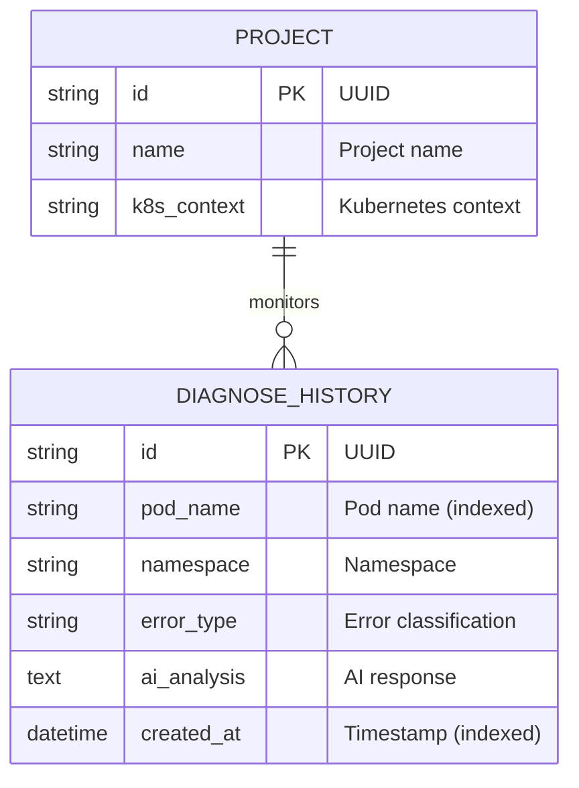
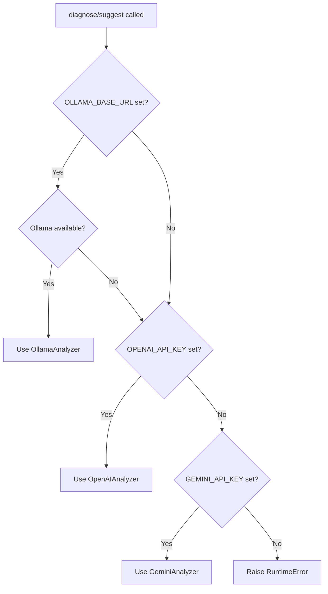
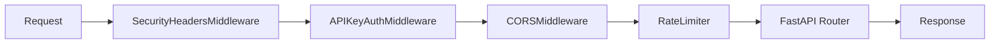
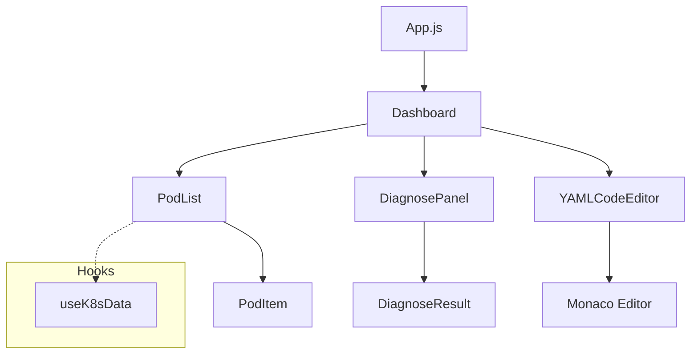

# 🦞 Lobster K8s Copilot - System Design (SD)

> **Version**: 1.0 | **Date**: 2026-03-07 | **Status**: Approved

---

## 1. API Specification

### 1.1 Base URL
```
Development: http://localhost:8000
Production:  https://lobster.example.com
```

### 1.2 Authentication
| Method | Header | Description |
|--------|--------|-------------|
| Bearer Token | `Authorization: Bearer <token>` | API key as bearer token |
| API Key | `X-API-Key: <token>` | Direct API key header |

*Authentication is optional when `LOBSTER_API_KEY` is not set.*

---

### 1.3 API Endpoints

#### Health & Status

| Method | Endpoint | Description |
|--------|----------|-------------|
| GET | `/` | API health check |
| GET | `/api/v1/cluster/status` | Kubernetes cluster connection status |

**GET /** 
```json
{
  "message": "Lobster K8s Copilot API is running",
  "version": "1.0.0"
}
```

**GET /api/v1/cluster/status**
```json
{
  "status": "connected",  // or "disconnected"
  "error": null           // or error message
}
```

---

#### Pod Management

| Method | Endpoint | Description |
|--------|----------|-------------|
| GET | `/api/v1/cluster/pods` | List all pods across namespaces |
| GET | `/api/v1/cluster/pods?namespace=default` | List pods in specific namespace |

**Response: PodListResponse**
```json
{
  "pods": [
    {
      "name": "nginx-deployment-abc123",
      "namespace": "default",
      "status": "Running",
      "ip": "10.1.2.3",
      "conditions": [
        {"type": "Ready", "status": "True"},
        {"type": "ContainersReady", "status": "True"}
      ]
    }
  ],
  "total": 1
}
```

---

#### AI Diagnosis

| Method | Endpoint | Description |
|--------|----------|-------------|
| POST | `/api/v1/diagnose/{pod_name}` | AI diagnosis for a specific pod |
| GET | `/api/v1/diagnose/history` | Recent diagnosis history (50 records) |
| GET | `/api/v1/diagnose/history/{pod_name}` | History for a specific pod |

**POST /api/v1/diagnose/{pod_name}**

Request:
```json
{
  "namespace": "default",
  "force": false
}
```

Response: `DiagnoseResponse`
```json
{
  "pod_name": "my-app-7b9c8d",
  "namespace": "default",
  "error_type": "CrashLoopBackOff",
  "root_cause": "Application fails to connect to database on startup",
  "detailed_analysis": "The pod is restarting repeatedly because...",
  "remediation": "1. Check database connectivity\n2. Verify DB_HOST environment variable",
  "raw_analysis": "{\"root_cause\": \"...\", \"remediation\": \"...\"}",
  "model_used": "gpt-4"
}
```

**GET /api/v1/diagnose/history**

Response: `DiagnoseHistoryRecord[]`
```json
[
  {
    "id": "uuid-123",
    "pod_name": "my-app-7b9c8d",
    "namespace": "default",
    "error_type": "CrashLoopBackOff",
    "ai_analysis": "Application fails to connect...",
    "created_at": "2026-03-07T10:30:00Z"
  }
]
```

---

#### YAML Scanning

| Method | Endpoint | Description |
|--------|----------|-------------|
| POST | `/api/v1/yaml/scan` | Scan YAML for anti-patterns |
| POST | `/api/v1/yaml/diff` | Compare two YAML manifests |

**POST /api/v1/yaml/scan**

Request:
```json
{
  "yaml_content": "apiVersion: apps/v1\nkind: Deployment\n...",
  "filename": "deployment.yaml"
}
```

Response: `YamlScanResponse`
```json
{
  "filename": "deployment.yaml",
  "issues": [
    {
      "severity": "ERROR",
      "rule": "no-resource-limits",
      "message": "Container 'nginx' is missing CPU/Memory resource limits.",
      "line": null
    },
    {
      "severity": "WARNING",
      "rule": "no-liveness-probe",
      "message": "Container 'nginx' has no livenessProbe.",
      "line": null
    }
  ],
  "total_issues": 2,
  "has_errors": true,
  "ai_suggestions": "Add resource limits to prevent OOM kills..."
}
```

**POST /api/v1/yaml/diff**

Request:
```json
{
  "yaml_a": "apiVersion: v1\nkind: ConfigMap\n...",
  "yaml_b": "apiVersion: v1\nkind: ConfigMap\n..."
}
```

Response: DeepDiff format
```json
{
  "values_changed": {
    "root['data']['key1']": {
      "new_value": "newval",
      "old_value": "oldval"
    }
  }
}
```

---

## 2. Database Schema

### 2.1 Entity Relationship Diagram



### 2.2 Table Definitions

#### projects
| Column | Type | Constraints | Description |
|--------|------|-------------|-------------|
| id | VARCHAR(36) | PRIMARY KEY | UUID |
| name | VARCHAR(255) | NOT NULL | Project name |
| k8s_context | VARCHAR(255) | NOT NULL | kubectl context name |

#### diagnose_history
| Column | Type | Constraints | Description |
|--------|------|-------------|-------------|
| id | VARCHAR(36) | PRIMARY KEY | UUID |
| pod_name | VARCHAR(253) | NOT NULL, INDEX | Pod name |
| namespace | VARCHAR(253) | NOT NULL, DEFAULT 'default' | Namespace |
| error_type | VARCHAR(100) | NULL | Error classification |
| ai_analysis | TEXT | NULL | AI diagnosis text |
| created_at | DATETIME | NOT NULL, INDEX | Record creation time |

**Indexes:**
- `ix_diagnose_history_pod_namespace (pod_name, namespace)`
- `ix_diagnose_history_created_at (created_at)`

---

## 3. Anti-Pattern Rules

### 3.1 Rule Definitions

| Rule ID | Severity | Target | Description |
|---------|----------|--------|-------------|
| `no-resource-limits` | ERROR | Container | Missing `resources.limits` |
| `no-resource-requests` | WARNING | Container | Missing `resources.requests` |
| `privileged-container` | ERROR | Container | `securityContext.privileged: true` |
| `run-as-root` | ERROR | Container | Missing `securityContext.runAsNonRoot: true` |
| `no-liveness-probe` | WARNING | Container | Missing `livenessProbe` |
| `no-readiness-probe` | WARNING | Container | Missing `readinessProbe` |
| `latest-image-tag` | WARNING | Container | Image uses `:latest` or no tag |
| `ingress-nginx-deprecation` | ERROR | Ingress | Uses deprecated ingress-nginx |

### 3.2 Supported Kubernetes Kinds
- Deployment
- DaemonSet
- StatefulSet
- ReplicaSet
- Pod
- Job
- CronJob
- Ingress

---

## 4. AI Engine Design

### 4.1 Provider Selection Algorithm



### 4.2 Prompt Templates

**Diagnosis Prompt (k8s_prompts.py)**
```
You are a Kubernetes expert diagnosing a failing pod.

Pod: {pod_name}
Namespace: {namespace}
Error Type: {error_type}

=== Pod Description ===
{describe}

=== Recent Logs ===
{logs}

Analyze the root cause and provide remediation steps.
Respond in JSON format:
{
  "root_cause": "...",
  "detailed_analysis": "...",
  "remediation": "..."
}
```

**YAML Scan Prompt**
```
You are a Kubernetes security expert.
Review these issues found in a YAML manifest and provide remediation advice.

Issues:
{issues}

YAML snippet:
{yaml_content}

Provide concise, actionable remediation steps.
```

---

## 5. Middleware Stack



### 5.1 SecurityHeadersMiddleware
Adds the following headers to all responses:
- `X-Content-Type-Options: nosniff`
- `X-Frame-Options: DENY`
- `X-XSS-Protection: 1; mode=block`
- `Referrer-Policy: strict-origin-when-cross-origin`
- `Permissions-Policy: geolocation=(), microphone=(), camera=()`
- `Strict-Transport-Security` (HTTPS only)

### 5.2 APIKeyAuthMiddleware
- Validates `Authorization: Bearer <token>` or `X-API-Key: <token>`
- Uses `secrets.compare_digest()` for timing-safe comparison
- Excludes: `/`, `/docs`, `/redoc`, `/openapi.json`

### 5.3 Rate Limiting
- Global rate limit via SlowAPI
- Default: 100 requests/minute per IP

---

## 6. Frontend Components

### 6.1 Component Hierarchy



### 6.2 Key Components

| Component | Purpose |
|-----------|---------|
| `Dashboard` | Main page layout |
| `PodList` | Displays pods from cluster |
| `DiagnosePanel` | Shows AI diagnosis results |
| `YAMLCodeEditor` | Monaco-based YAML editor with scan |

### 6.3 API Client (utils/api.js)

```javascript
const API_BASE = process.env.REACT_APP_API_URL || '';

export const api = {
  getPods: (namespace) => fetch(`${API_BASE}/api/v1/cluster/pods?namespace=${namespace}`),
  diagnose: (podName, namespace) => fetch(`${API_BASE}/api/v1/diagnose/${podName}`, {
    method: 'POST',
    headers: {'Content-Type': 'application/json'},
    body: JSON.stringify({namespace})
  }),
  scanYaml: (content) => fetch(`${API_BASE}/api/v1/yaml/scan`, {
    method: 'POST',
    headers: {'Content-Type': 'application/json'},
    body: JSON.stringify({yaml_content: content})
  }),
  diffYaml: (yamlA, yamlB) => fetch(`${API_BASE}/api/v1/yaml/diff`, {
    method: 'POST',
    headers: {'Content-Type': 'application/json'},
    body: JSON.stringify({yaml_a: yamlA, yaml_b: yamlB})
  })
};
```

---

## 7. Error Handling

### 7.1 HTTP Status Codes

| Code | Meaning | Example |
|------|---------|---------|
| 200 | Success | Normal response |
| 400 | Bad Request | Invalid path traversal |
| 401 | Unauthorized | Missing/invalid API key |
| 404 | Not Found | Pod not found |
| 422 | Validation Error | Invalid pod name format |
| 429 | Rate Limited | Too many requests |
| 500 | Server Error | Internal failure |

### 7.2 Error Response Format

```json
{
  "detail": "Human readable error message"
}
```

---

## 8. Configuration

### 8.1 Environment Variables

| Variable | Required | Default | Description |
|----------|----------|---------|-------------|
| `DATABASE_URL` | No | `sqlite:///./lobster.db` | Database connection string |
| `LOBSTER_API_KEY` | Prod | — | API authentication key |
| `ALLOWED_ORIGINS` | Prod | — | CORS allowed origins (comma-separated) |
| `OPENAI_API_KEY` | Conditional | — | OpenAI API key |
| `GEMINI_API_KEY` | Conditional | — | Google Gemini API key |
| `OLLAMA_BASE_URL` | No | `http://localhost:11434` | Ollama server URL |
| `OLLAMA_MODEL` | No | `llama3` | Ollama model name |
| `AI_ENGINE_URL` | No | — | External AI engine endpoint |
| `FRONTEND_BUILD_DIR` | No | `frontend/build` | SPA build directory |

### 8.2 Kubernetes RBAC

```yaml
apiVersion: rbac.authorization.k8s.io/v1
kind: ClusterRole
metadata:
  name: lobster-reader
rules:
  - apiGroups: [""]
    resources: ["pods", "pods/log", "events", "namespaces"]
    verbs: ["get", "list", "watch"]
  - apiGroups: ["apps"]
    resources: ["deployments", "daemonsets", "statefulsets", "replicasets"]
    verbs: ["get", "list"]
```

---

## 9. Data Masking

### 9.1 Sensitive Data Patterns

The following patterns are masked before sending to LLM:

| Pattern | Description |
|---------|-------------|
| `password=...` | Password values |
| `secret=...` | Secret values |
| `token=...` | Token values |
| `Bearer ...` | Bearer tokens |
| `-----BEGIN.*KEY-----` | SSH/PGP keys |
| `ghp_`, `gho_`, `ghs_` | GitHub tokens |
| `glpat-` | GitLab tokens |
| Base64 in K8s `data:` blocks | Encoded secrets |

### 9.2 Implementation

```python
SENSITIVE_PATTERNS = [
    (r"(password|passwd|pwd)[\s]*[=:]\s*[\S]+", r"\1=***MASKED***"),
    (r"(secret|token|key)[\s]*[=:]\s*[\S]+", r"\1=***MASKED***"),
    (r"Bearer\s+[\w\-._~+/]+=*", "Bearer ***MASKED***"),
    (r"-----BEGIN[^-]*PRIVATE KEY-----[\s\S]*?-----END[^-]*PRIVATE KEY-----", 
     "***PRIVATE_KEY_MASKED***"),
]
```

---

*Document Owner: Engineering Team*
*Last Updated: 2026-03-07*
